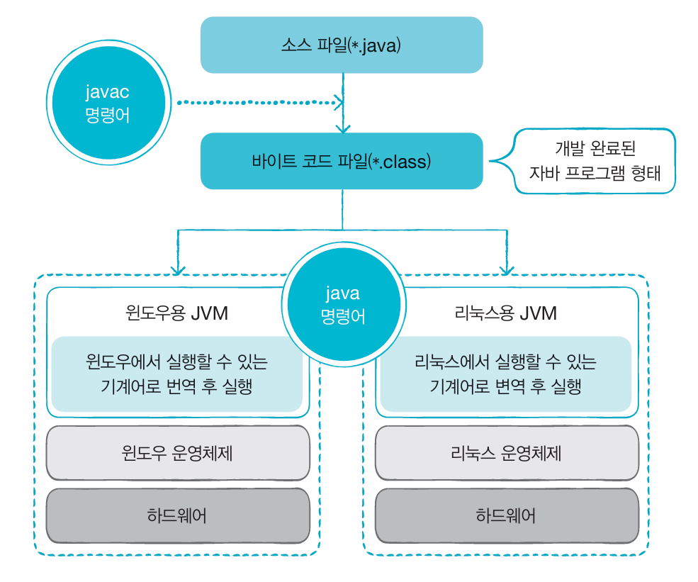
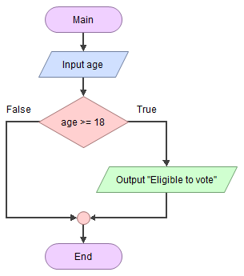
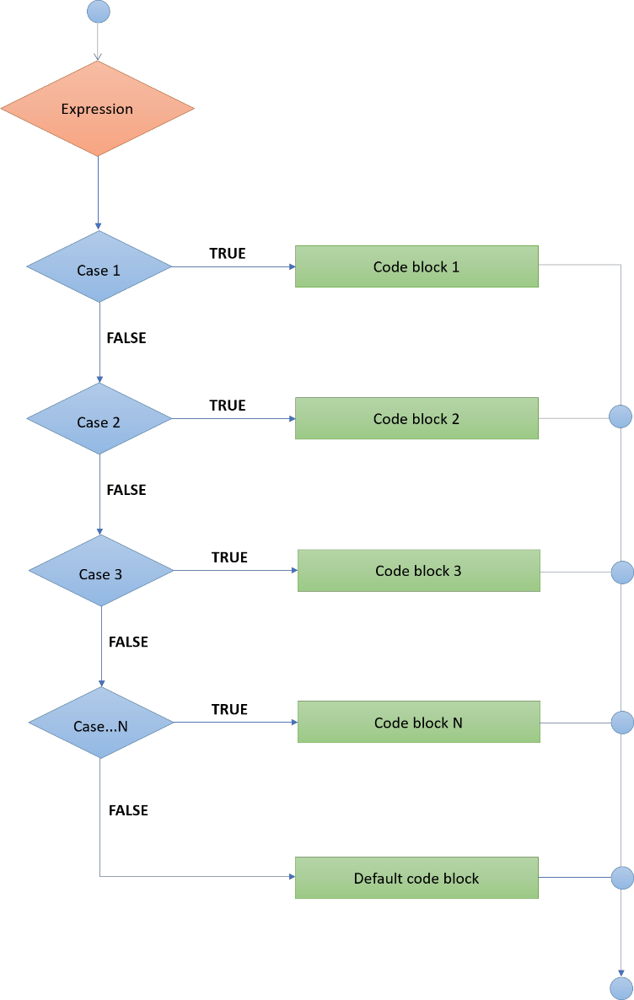
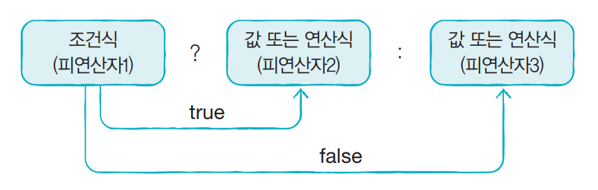

# Day 02

## 💡 주제
```
📌 조건문
   ➡️ if-else
   ➡️ switch-case
   ➡️ 삼항연산자
📌 반복문
   ➡️ for
   ➡️ while
   ➡️ do-while
```

## 📄 파일 설명
| 파일명 | 내용 |
|:--   |:--      |
| Ex01_Condition01 ~ Ex09_Condition09 | 조건문 예제 |
| Ex10_Loop01 ~ Ex26_Loop17 | 반복문 예제 |

## ✏️ 정리

### 자바 프로그램 실행 과정


### 조건문
**1) if-else**
- 조건이 참일 때는 if 블록을 실행하고, 거짓일 때는 else 블록을 실행함<br>
- else if를 사용하여 추가 조건을 설정할 수 있음


**2) switch-case**
- 변수 값에 따라 여러 케이스 중 하나를 선택하여 실행함<br>
- if-else 보다 조건이 단순할 때 유용함<br>
- 숫자나 문자열과 같은 특정 값에 대해 처리할 수 있음<br>
- default를 사용하여 일치하는 케이스가 없을 때 실행할 코드를 정의할 수 있음


**3) 삼항연산자**
- 조건문을 간단하게 한 줄로 표현할 수 있는 연산자임<br>
- **조건 ? 값1 : 값2** 형태로, 조건이 참일 때는 값1을, 거짓일 때는 값2를 반환함 <br>
- 간단한 조건 처리에 유용하며, 복잡한 논리는 가독성이 떨어질 수 있음


### 반복문
**1) for**
- 반복 횟수가 정해져 있을 때 주로 사용함<br>
- 초기화식, 조건식, 증감식을 포함하여 반복 조건을 명확하게 설정해야 함<br>
- 중첩된 for 문을 사용하여 다차원 배열과 같은 복잡한 패턴도 처리할 수 있음

**2) while**
- 조건이 참인 동안 계속 반복함<br>
- 반복 횟수가 명확하지 않은 경우나 특정 조건에 따라 반복을 멈춰야 하는 경우에 유용함<br>

**3) do-wihle**
- while과 비슷하지만, 조건을 나중에 검사하기 때문에 최소 한 번은 반드시 실행됨<br>
- 주로 사용자 입력과 같은 반복적 작업에서 유용하게 사용됨<br>

## 📑 참고
- 온라인 자바 튜토리얼: https://www.w3schools.com/java/
