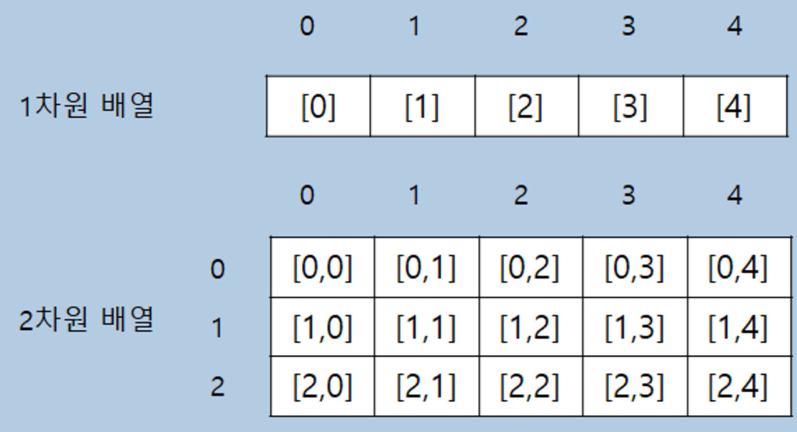
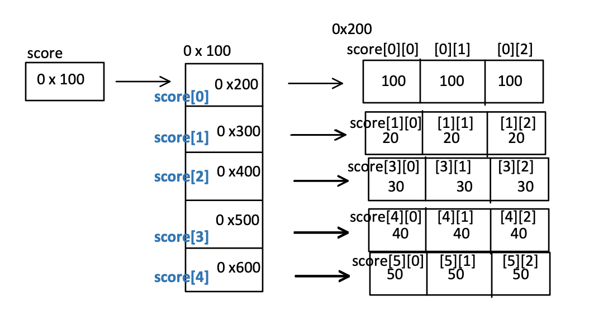

# Day 03

## 💡 주제
```
📌 배열
   ➡️ 1차원, 2차원 배열의 선언, 초기화 및 활용법 이해하기
📌 메서드
   ➡️ 메서드의 선언, 호출, 오버로딩 및 가변 인자 사용법 이해하기
📌 객체와 클래스
   ➡️ 객체 지향 프로그래밍의 기본 개념인 클래스와 객체의 생성 및 활용 이해하기
📌 스택과 힙
   ➡️ 메모리 구조에서 스택과 힙의 역할 및 참조 자료형의 저장 공간 이해하기
```

## 📄 파일 설명
| 파일명 | 내용 |
|:--   |:--      |
| Ex01_Array01 ~ Ex12_Array12 | 배열 선언, 초기화, 다차원 배열, 가변 배열, 명령줄 인자 처리 등 |
| Ex13_Object01 | 클래스 객체 생성 및 객체의 멤버 필드 사용 예제 |
| Ex14_Method01 ~ Ex18_Method05 | 메서드 서언, 오버로딩, 가변 인자, 메서드 호출 등 |
| Ex19_Operator01 ~ Ex20_Variable02 | 인스턴스 변수와 클래스 변수, 인스턴스 메서드와 클래스 메서드 |

## ✏️ 정리

### 참조 자료형의 저장 공간
**1) 스택(Stack)**  
  - 메서드 호출 시 지역 변수나 참조 변수를 저장하는 고정된 크기의 메모리 영역<br>
  - **LIFO(Last In, First Out)** 방식으로 빠르게 할당 및 해제됨
  
**2) 힙(Heap)**  
  - 동적으로 생성된 객체나 배열이 저장되는 메모리 영역<br>
  - 크기가 유연하며, 가비지 컬렉터에 의해 자동 관리됨<br>
  - **`new`로 생성된 객체와 배열**이 저장됨
  
**cf) 스택과 힙의 상호작용**  
  - 자바 프로그램에서 메모리 관리를 최적화하기 위해 함께 사용되며, **참조 변수는 스택에**, **객체는 힙에** 저장되는 방식으로 상호작용함<br>
<br>


### 행(Row)과 열(Column) 개념 정리
**1) 행(Row)**  
  - 2차원 배열에서 **가로 방향**으로 나열된 데이터<br>
  - 한 행은 여러 개의 열로 이루어져 있으며, 행 번호는 0부터 시작
  
**2) 열(Column)** 
  - 2차원 배열에서 **세로 방향**으로 나열된 데이터<br>
  - 각 열은 동일한 위치의 행에서 모인 데이터들로 구성됨<br>
  - 열 번호 역시 0부터 시작
 
#### 예시

|     | 0   | 1   | 2   |
|-----|-----|-----|-----|
| 0   | 1   | 2   | 3   |
| 1   | 4   | 5   | 6   |
| 2   | 7   | 8   | 9   |

- 첫 번째 행(arr[0]): `{1, 2, 3}`
- 첫 번째 열(arr[0][0], arr[1][0], arr[2][0]): `{1, 4, 7}`





### String[] args (아규먼트, 인자)에 대한 설명
**`args` 배열**
  - 프로그램 실행 시 전달되는 명령줄 인자를 담고 있으며, **인자의 수는 가변적**<br>
  - `args` 배열은 **비어 있을 수도**, 여러 개의 값을 포함할 수도 있음
  
#### 예시

```bash
java MainExample Hello World 123
```

## 📑 참고
- 온라인 자바 튜토리얼: https://www.w3schools.com/java/
- Java SE 17 API String 문서: https://docs.oracle.com/en/java/javase/17/docs/api/java.base/java/lang/String.html