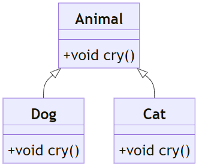
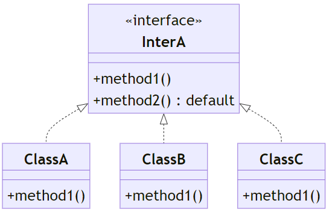

# Day 05

## 💡 주제
```
📌 다형성 (Polymorphism)
 ➡️ 부모 클래스 타입으로 자식 클래스를 참조할 수 있는 개념을 이해하고, 이를 통해 코드의 유연성을 높이는 방법 학습

📌 추상 클래스 (Abstract Class)
 ➡️ 추상 메서드와 일반 메서드를 포함하는 추상 클래스의 개념을 이해하고, 상속을 통해 추상 메서드를 구현하는 방법 학습

📌 인터페이스 (Interface)
 ➡️ 인터페이스의 역할과 구현 방법을 학습하고, 다중 상속 및 일관된 메서드 구현을 위한 인터페이스 사용법 익히기

📌 디폴트 메서드 (Default Method)
 ➡️ 자바 8에서 추가된 인터페이스의 디폴트 메서드의 개념을 이해하고, 인터페이스에서 기본 구현을 제공하는 방법 학습

📌 형변환과 instanceof ➡️
 업캐스팅과 다운캐스팅의 차이점 및 안전한 형변환을 위한 instanceof 연산자 사용법 학습

📌 패키지 (Package) ➡️
 패키지의 개념과 패키지 구조를 통한 클래스 분류 및 관리 방법 학습
```

## 📄 파일 설명
| 파일명 | 내용 |
|:--   |:--      |
| Ex01_Poly01 ~ Ex03_Poly03 | 클래스 타입 변환과 다형성, 메서드 오버라이딩을 다룬 예제 |
| Ex04_Abstract | 추상 클래스와 추상 메서드, 추상 클래스의 생성자 및 메서드 구현 예제 |
| Ex05_Interface01 ~ Ex06_Interface02 | 인터페이스 구현과 다형성, 인터페이스 상속 및 구현 예제 |
| Ex07_DefaultMethod01 | 인터페이스의 디폴트 메서드를 활용한 예제 |
| Ex08_InstanceOf01 | instanceof 연산자를 활용한 타입 체크와 형 변환 예제 |
| com folder | 패키지 구조와 관련된 클래스들을 포함한 예제 |
| Prac01 ~ Prac05 | 실습 문제 풀이 |

## ✏️ 정리

### 상속과 은닉

#### 상속을 위한 문법

| 키워드/개념      | 설명                          | 예시                                |
|-- |--  |--  |
| `extends`       | 클래스 상속을 위해 사용          | `class 자식 extends 부모 {}`        |
| `implements`    | 인터페이스 구현을 위해 사용      | `class 클래스 implements 인터페이스 {}` |
| `super`         | 부모 클래스의 멤버에 접근        | `super.부모메서드();`               |
| `super()`       | 부모 클래스의 생성자 호출        | `super(매개변수);`                  |
| `this`          | 현재 객체의 멤버에 접근          | `this.멤버변수 = 값;`               |
| `this()`        | 같은 클래스의 다른 생성자 호출    | `this(매개변수);`                   |
| `final 클래스`   | 상속 불가능한 클래스            | `final class 최종클래스 {}`          |
| `final 메서드`   | 오버라이딩 불가능한 메서드        | `final void 최종메서드() {}`         |
| `Overriding`    | 부모 클래스의 메서드를 재정의     | `@Override void 메서드() {}`         |

<br>

#### 은닉을 위한 문법

| 키워드/개념        | 설명                                   | 예시                                  |
|--  |--  |--  |
| `protected`        | 같은 패키지와 자식 클래스에서 접근 가능   | `protected int 보호변수;`             |
| `private`          | 같은 클래스 내에서만 접근 가능          | `private int 비공개변수;`             |
| `public`           | 어디서든 접근 가능                     | `public void 공개메서드() {}`         |
| `default` (package-private) | 같은 패키지 내에서만 접근 가능      | `int 기본접근변수;`                   |
| `getter`           | `private` 멤버 변수의 값을 반환하는 메서드 | `public int getValue() { return value; }` |
| `setter`           | `private` 멤버 변수의 값을 설정하는 메서드 | `public void setValue(int value) { this.value = value; }` |

<br><br>

### 참조 자료형의 형변환

**1) 업캐스팅 (Upcasting)**
- **업캐스팅**은 하위 클래스의 객체를 상위 클래스 타입으로 변환하는 것을 말함
- 이는 자바에서 **암시적으로 이루어지며**, 별도의 명시적 형변환이 필요하지 않음

   - 업캐스팅은 **자동**으로 발생함
   - 하위 클래스의 객체는 상위 클래스 타입으로 참조될 수 있으며, 상위 클래스의 메서드만 사용할 수 있음
   - 다형성을 이용해 상위 클래스의 참조를 사용하더라도, **실제 객체**는 여전히 하위 클래스의 메서드를 호출함 (오버라이딩된 경우)
   
   **예시**
   ```java
   Parent p = new Child(); // 업캐스팅 (자동으로 발생)
   p.viewData1(); // 오버라이딩된 하위 클래스 메서드 호출
   ```

<br>

**2) 다운캐스팅 (Downcasting)**
- **다운캐스팅**은 상위 클래스의 객체를 하위 클래스 타입으로 변환하는 것을 말함
- 이는 반드시 **명시적으로 형변환**을 해주어야 하며, 올바르게 캐스팅되지 않으면 **`ClassCastException`**이 발생할 수 있음
   
   - 다운캐스팅은 **명시적**으로 형변환을 해줘야 함
   - 다운캐스팅 후에는 하위 클래스의 메서드나 속성에 접근할 수 있음
   - **잘못된 다운캐스팅**은 프로그램 오류를 일으키며, **`ClassCastException**을 유발할 수 있으므로 주의가 필요함

   **예시**
   ```Java
   Parent p = new Child(); // 업캐스팅
   Child c = (Child) p; // 다운캐스팅 (명시적 형변환)
   c.viewData(); // 하위 클래스의 메서드 호출
   ```

   ** 잘못된 다운캐스팅 예시**
   ```Java
   Parent p = new Parent();
   Child c = (Child) p; // 에러 발생 : ClassCastException
   ```

<br><br>

### 추상 클래스 (Abstract Class)
- 추상 클래스는 구현되지 않은 추상 메서드를 포함할 수 있는 클래스임
- 일반 클래스와 비슷하지만, 추상 메서드가 포함된 클래스는 **객체를 직접 생성할 수 없음**
- 추상 클래스는 partial implementation을 제공함
   -> 즉, 일부 메서드만 구현된 상태로, 자식 클래스가 나머지 세부 사항을 구현해야 함

<br>

**추상 클래스의 특징**
- **추상 메서드를 하나 이상 가질 수 있음**<br>
   (단, 모든 메서드가 추상적일 필요는 없음)
- **객체를 직접 생성할 수 없음**
- **상속을 통해서만 사용**됨
- 추상 클래스는 다른 일반 메서드나 필드도 포함할 수 있음



<br><br>

### 인터페이스 (Interface)
- 인터페이스는 **클래스들이 반드시 구현해야 할 "약속" 혹은 "계약"**을 정의하는 구조임
- 인터페이스는 **메서드의 선언만**을 포함하고, 구체적인 **구현은 포함하지 않음**
- **구현하는 클래스에서 해당 메서드들을 반드시 구현하도록 강제**합니다.

<br>

**특징**
- **강제적인 구현**: 인터페이스를 구현하는 클래스는 인터페이스에 선언된 모든 메서드를 반드시 구현해야 함
- **다중 상속을 지원**: 자바는 클래스에서 다중 상속을 허용하지 않지만, 인터페이스는 여러 개를 동시에 구현할 수 있음
- **코드의 유연성 증가**: 여러 클래스가 동일한 메서드를 구현하여, 클래스 간 일관성을 유지할 수 있음

<br>



<br>

**인터페이스 선언 및 구현**

[인터페이스 선언]<br>
-> 인터페이스는 `interface` 키워드를 사용하여 선언하며, 메서드는 **구체적인 구현 없이** 선언만 함

```java
interface Animal {
    // 추상 메서드 (구현이 없는 메서드 선언)
    void sound();
    void sleep();
}
```

<br>

[인터페이스 구현]<br>
-> 인터페이스를 구현하는 클래스는 `implements` 키워드를 사용하며, 인터페이스에 선언된 모든 메서드를 **반드시 구현**해야 함

```Java
//Dog 클래스는 Animal 인터페이스를 구현
class Dog implements Animal{
   @Override
   public void sound(){
      System.out.println("멍멍");
   }

   @Override
   public void sleep(){
      System.out.println("강아지가 잠을 잡니다.");
   }
}
```

<br>

cf) 인터페이스는 상수를 정의할 수 있음<br>
-> 인터페이스에 정의된 상수는 기본적으로 `public static final`임

```Java
interface Animal{
   // 상수 선언 (자동으로 public static final)
   int MAX_AGE = 20;
}
```

<br>

**인터페이스와 추상 클래스의 차이점**

| 특징 | 인터페이스 | 추상 클래스 |
|:--  |:-- |:-- |
| **메서드 구현 여부** | 모든 메서드는 기본적으로 구현이 없음 (Java 8 이후에는 `default` 메서드 가능) | 일부 메서드는 구현될 수 있음 |
| **다중 상속 여부** | 여러 인터페이스를 동시에 구현 가능 | 단일 클래스만 상속 가능 |
| **필드** | 상수만 선언 가능 | 인스턴스 필드와 상수 선언 가능 |
| **목적** | 클래스 간 **공통된 행위 규약** 정의 | 클래스 간의 **공통된 동작과 상태** 정의 |

<br><br>

### 디폴트 메서드
- **디폴트 메서드**는 자바 8에서 인터페이스에 도입된 기능으로, **인터페이스 내에서 메서드의 기본 구현을 제공**할 수 있는 방법임
- 인터페이스에 새로운 메서드를 추가하면서, 기존 구현 클래스에 영향을 미치지 않도록 하기 위해 도입됨

   -> 즉, **인터페이스에 새로운 메서드를 추가해도 기존의 구현 클래스에서 오류가 발생하지 않도록** 기본 구현을 제공하는 메서드임
- `default` 키워드를 사용하여 선언되며, 인터페이스를 구현하는 클래스에서 **선택적으로 오버라이딩**할 수 있음
- 구현 클래스에서 오버라이딩하지 않으면, **인터페이스에 정의된 기본 구현이 사용**됨

<br><br>

### instanceof
- `instanceof` 연산자는 자바에서 객체가 특정 클래스나 인터페이스의 인스턴스인지 여부를 확인하는 데 사용됨

   -> 즉, 객체의 실제 타입을 확인할 수 있는 도구임
- 주로 형변환 전에 객체가 원하는 타입인지 확인하는 데 사용되어, `ClassCastException`과 같은 오류를 방지하는 데 유용함

**기본 문법**
```Java
객체 instanceof 클래스 이름
```
- **객체** : 검사하려는 객체
- **클래스 이름** : 해당 객체가 속한지 확인하고자 하는 클래스 또는 인터페이스
- `interfaceof` 연산자는 결과로 `true` 또는 `false`를 반환함

<br><br>

### 인터페이스 메서드 종류
| 메서드 종류 | 선언 키워드 | 호출 방식 | 구현 | 오버라이딩 | 특징 |
|:-- |:-- |:-- |:-- |:-- |:-- |
| 추상 메서드 | `void methodA();` | 인터페이스를 구현한 클래스의 객체 | 구현 클래스에서 반드시 구현 | 가능 | 기본적으로 `public`이며, 구현 클래스에서 필수적으로 구현해야 함 |
| 디폴트 메서드 | `default void methodB(){} | 구현 클래스의 객체 | 인터페이스에서 기본 구현 제공 | 가능 | `default` 키워드를 사용하여 인터페이스 내에서 기본 구현을 제공하며, 필요에 따라 오버라이딩이 가능함 |
| 정적 메서드 | `static void methodC(){}` | 인터페이스의 이름을 통해 호출 | 인터페이스에서 구현 | 불가 | 인터페이스 자체에서 호출 가능하며, 클래스가 아닌 인터페이스에 속하고, 오버라이딩이 불가능함 |
| 프라이빗 메서드 | `private void methodD(){}` | 인터페이스 내에서만 호출 가능 | 인터페이스에서 구현 | 불가 | 인터페이스 내에서 로직을 재사용하기 위해 사용되며, 외부에서는 접근 불가능함 |
| 프라이빗 정적 메서드 | `private static void methodE(){}` | 인터페이스 내 정적 메서드에서 호출 | 인터페이스에서 구현 | 불가 | 정적 메서드 간에 공통된 로직을 처리할 때 사용되며, 외부에서는 접근 불가능함 |


- 추상 메서드
   - 인터페이스의 기본적인 메서드 형태로, **구현 클래스에서 반드시 구현**해야 하는 메서드임
   - 기본적으로 `public`이며, 명시하지 않아도 `public abstract`로 간주됨
- 디폴트 메서드
   - 자바 8에서 도입된 기능으로, 인터페이스에 **기본 구현을 제공**하는 메서드임
   - `default` 키워드를 사용하며, 필요에 따라 **구현 클래스에서 오버라이딩이 가능**함
   - 인터페이스가 새로운 메서드를 추가하면서 **기존 클래스 구현에 영향을 주지 않도록** 도와줌
- 정적 메서드
   - 인터페이스에 정적 메서드를 정의하여 **객체 없이도 호출**할 수 있음
   - **인터페이스 이름을 사용하여 호출**하며, **오버라이딩이 불가능**함
   - 주로 **유틸리티 함수**나 **공통된 기능**을 제공하는 용도로 사용됨
- 프라이빗 메서드
   - 자바 9에서 도입된 기능으로, **인터페이스 내부에서만 사용할 수 있는 메서드**임
   - **디폴트 메서드**나 **정적 메서드**에서 공통된 로직을 재사용할 때 유용하며, 외부에서 직접 호출하거나 오버라이딩 할 수 없음
- 프라이빗 정적 메서드
   - 정적 메서드 간에 **공통된 로직을 처리**할 때 사용되며, 외부에서는 접근할 수 없음
   - 다른 정적 메서드에서만 호출할 수 있고, 오버라이딩이 불가능함

<br><br>

### 패키지

**패키지의 목적과 필요성**
- **클래스 이름 충돌 방지**
   - 자바에서 많은 클래스가 존재할 수 있기 때문에 패키지를 사용하여 고유한 네임 스페이스를 제공함으로써 클래스 이름 충돌을 방지할 수 있음
   - 이렇게 함으로써 동일한 이름의 클래스도 서로 다른 패키지에 존재할 수 있음
- **코드의 구조적 관리**-
   - 패키지는 코드를 논리적이고 계층적인 구조를 조직화하여, 대규모 프로젝트에서도 코드를 쉽게 관리하고 탐색할 수 있게 함
- **접근 제어**
   - 같은 패키지 안에 있는 클래스끼리는 `package-private` (접근 제어자가 없는 상태) 접근 권한을 가지므로, 패키지를 기준으로 접근을 제한할 수 있음

**패키지 선언과 기본 방법**
- 자바에서 클래스를 특정 패키지에 포함시키려면 **패키지 선언**을 사용해야 함
- 패키지 선언은 **파일의 가장 첫 줄**에 위치해야 하며, 해당 클래스가 속할 패키지를 명시함

<br>

```Java
package 패키지이름;
public class 클래스명{
   // 클래스의 내용
}
```

<br>

[예시]
```Java
package com.example.project; //패키지 선언

public class MyClass{
   public void display(){
      System.out.prinln("패키지 예제");
   }
}
```

<br>

**이름 규칙**
- **소문자로 작성** : 클래스 이름과 구별하기 위해 패키지 이름은 소문자로 작성함
- **패키지와 디렉토리 구조가 일치해야 함** : 자바의 패키지 구조는 실제 **파일 시스템의 디렉토리 구조와 일치**해야 함

<br>

**import 문**
- 패키지에 있는 클래스를 사용하려면 `import`문을 사용하여 임포트해야 함
- 자바에서는 **단일 클래스**를 임포트하거나, 패키지 내의 **모든 클래스**를 임포트할 수 있음

<br>

[단일 클래스 임포트]
```Java
import com.example.project.MyClass;
```

<br>

[패키지 내 모든 클래스 임포트]
```Java
import com.example.project.*;
```

<br>

**주의**
- `imoprt`문은 **패키지 내 모든 클래스를 포함하는 것이 아니라**, 해당 패키지의 **직접적인 클래스만 임포트**함

   -> 하위 패키지는 자동으로 임포트되지 않음

<br>

**자바 패키지 컴파일**

- `javac -d` 명령어는 컴파일된 클래스 파일을 저장할 **출력 디렉토리**를 지정함
-이 옵션을 사용하면, 자바 컴파일러는 패키지 구조를 기반으로 디렉토리를 자동으로 생성하고, 해당 디렉토리 안에 `.class` 파일을 저장함

   ```
   javac -d [출력 디렉토리 경로] [컴파일할 자바 파일]
   ```
   - **[출력 디렉토리 경로]** : 컴파일된 `.class` 파일을 저장할 경로
   - **[컴파일할 자바 파일]** : 컴파일할 자바 소스 파일의 경로

   <br>

   예시
   ```
   javac -d -encoding utf-8 Pack2.java
   ```


<br><br>

## 📑 참고
- 온라인 자바 튜토리얼: https://www.w3schools.com/java/