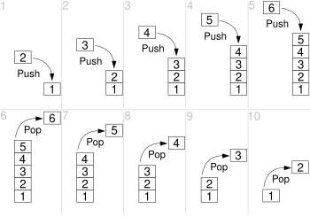
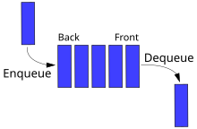

# Day 07

## 💡 주제
```
📌 상속과 구성 관계 (`is-a` vs. `has-a`)
   ➡️ 객체 간의 관계를 이해하고, 상속과 구성을 통해 효율적으로 클래스 구조 설계하기
   
📌 System 클래스 및 환경 설정 관련 메서드
   ➡️ 시스템의 시간, 환경 변수, 시스템 속성 등에 접근하고, 프로그램 제어하기

📌 Date와 Calendar 클래스
   ➡️ 날짜와 시간을 다루고 조작하는 방법 및 다양한 포맷으로 출력하기

📌 문자열 분리 (`StringTokenizer` vs `String.split()`)
   ➡️ 다양한 문자열 분리 도구를 사용하여 문자열을 가공하고 효율적으로 처리하기

📌 Random 클래스와 난수 생성
   ➡️ 다양한 난수 생성 방법을 이해하고 활용하기

📌 Arrays 클래스의 활용
   ➡️ 배열을 다루는 기본적인 메서드 (정렬, 검색, 문자열 변환 등)를 이해하기

📌 컬렉션 프레임워크 기본 이해 (ArrayList, HashSet, HashMap 등)
   ➡️ 데이터의 저장과 조회를 효율적으로 수행하기 위한 컬렉션 활용 및 비교

📌 제네릭과 컬렉션 사용 시 형 안전성 보장
   ➡️ 제네릭을 사용하여 형 변환 문제를 해결하고, 코드의 가독성 및 안전성을 높이기

📌 스택과 큐의 구조와 주요 사용 사례
   ➡️ LIFO와 FIFO 자료구조의 개념을 이해하고 적절히 활용하기
```

## 📄 파일 설명
| 파일명                                             | 내용                                                                              |
|:------------------------------------------------|:--------------------------------------------------------------------------------|
| Ex01_Wrapper01                                  | 기본 자료형을 Wrapper 클래스로 변환하여 객체로 다루는 예제                                            |
| Ex02_System01 ~ Ex03_System02                   | `System` 클래스의 주요 메서드를 활용하여 시스템 속성, 환경 변수 등을 다루는 예제                              |
| Ex04_ProcessBuilder01                           | `ProcessBuilder`를 사용하여 외부 프로세스를 실행하고 제어하는 예제                                    |
| Ex05_Date01                                     | `Date` 클래스를 사용해 특정 날짜와 시간 처리 예제                                                 |
| Ex06_Calendar01 ~ Ex08_Calendar03               | `Calendar` 클래스를 사용하여 날짜와 시간 정보를 설정하고 가져오는 다양한 예제                                |
| Ex09_StringTokenizer01 ~ Ex10_StringTokenizer02 | `StringTokenizer`를 활용한 문자열 분리와 구분자 처리 예제                                        |
| Ex11_StringJoiner01                             | `StringJoiner` 클래스를 사용하여 문자열을 특정 구분자로 이어붙이는 예제                                  |
| Ex12_Random01 ~ Ex13_Random02                   | `Random` 클래스를 활용하여 다양한 난수 생성 및 시드 사용 예제                                         |
| Ex14-Array01                                    | 배열의 초기화와 접근, `Arrays` 클래스의 기본 메서드를 활용한 배열 조작 예제                                 |
| Ex15_Scanner01 ~ Ex17_Scanner03                 | `Scanner` 클래스를 사용하여 사용자 입력을 처리하는 예제                                             |
| Ex18_ArrayList01                                | `ArrayList`를 사용하여 동적 배열을 관리하고 데이터를 추가 및 삭제하는 예제                                 |
| Ex19_Generic01 ~ Ex20_Generic02                 | 제네릭을 활용하여 특정 데이터 타입의 `ArrayList` 또는 사용자 정의 객체를 저장하고 관리하는 예제                     |
| Ex21_HashSet01 ~ Ex22_HashSet02                 | `HashSet`을 사용하여 중복을 허용하지 않는 데이터 집합을 관리하고, `equals`와 `hashCode` 메서드로 중복을 판별하는 예제 |
| Ex23_HashMap01 ~ Ex24_HashMap02                 | `HashMap`을 사용하여 키-값 쌍으로 데이터를 관리하고 조회하는 예제                                       |
| Ex25_Properties01                               | `Properties` 클래스를 활용해 설정 정보 저장, 사용자 정의 속성 관리, 시스템 속성 조회 예제                      |
| Ex26_Stack01                                    | `Stack` 자료구조를 사용하여 요소를 후입선출(LIFO) 방식으로 추가, 제거하는 예제                              |
| Ex27_Queue01                                    | `Queue` 자료구조를 사용하여 요소를 선입선출(FIFO) 방식으로 추가, 제거하는 예제                              |

## ✏️ 정리

### is-a (상속) 관계와 has-a (구성) 관계
- `is-a` 관계와 `has-a` 관계는 자바에서 객체 간의 관계를 설명하는 중요한 개념으로, 상속과 구성을 구분하는 데 사용됨
- 이러한 두 관계는 객체지향 프로그래밍에서 **재사용성, 구조 설계, 계층 구조**를 정의하는 데 매우 중요함

**1) `is-a` 관계 (상속 관계)**
- `is-a` 관계는 상속을 통해 정의되며, **하위 클래스가 상위 클래스의 특성을 상속 받는 관계**를 의미함<br>
  (즉, 하위 클래스는 상위 클래스의 일종임)
- 특징
  - 상속을 이용하여 하위 클래스가 상위 클래스의 속성과 행동을 물려 받음
  - 하위 클래스는 상위 클래스의 모든 동작과 속성을 재사용하거나 오버라이딩할 수 있음
  - 하위 클래스는 상위 클래스의 특수한 유형임
  - 예를 들면, "개는 동물의 일종이다" -> `Dog is a Animal`
    
  ```java
  class Animal {
    void eat(){
        System.out.println("This animal is eating");
    }
  }
  
  class Dog{
    void bark(){
        System.out.println("The dog is barking");
    }
  }
  
  public class Main{
    public static void main(String[] args){
        Dog dog = new Dog();
        dog.eat(); // 상위 클래스인 Animal의 메서드 사용
        dog.bark(); // Dog 클래스의 메서드 사용  
    } 
  }
  ```

<br>

**2) `has-a` 관계 (구성 관계)**
- `has-a` 관계는 구성을 통해 정의되며, 한 클래스가 다른 클래스의 객체를 포함하는 관계를 의미함<br>
  (즉, 한 객체가 다른 객체를 소유하거나 구성 요소로 포함하고 있다는 의미임)
- 특징
  - 클래스 A가 클래스 b의 인스턴스를 속성 (필드)으로 가짐
  - 구성된 클래스 (즉, 포함된 클래스)의 동작을 사용하지만, 상속 관계는 아님
  - 이 관계는 상속 보다는 클래스 간의 협력을 나타냄
  - 예를 들면, "자도차는 엔진을 가지고 있다" -> "Car has a Engine"

  ```java
  class Engine{
    void start(){
        System.out.println("Engine started");
    }
  }
  
  class Car{
    private Engine engine; // Car 클래스가 Engine 객체를 가짐 (has-a 관계)
    
    Car(){
        engine = new Engine(); // Car 생성자에서 Engine 인스턴스 생성
    }
  
    void drive(){
        engine.start();
        System.out.println("Car is driving");
    }
  }
  
  public class Main{
    public static void main(String[] args){
        Car car = new Car();
        car.drive();
    }
  }
  ```

<br>

**3) `is-a`와 `has-a` 관계 비교**

| 특징                | is-a 관계 (상속)                                  | has-a 관계 (구성)                                |
|---------------------|--------------------------------------------------|--------------------------------------------------|
| **관계의 의미**     | 하위 클래스는 상위 클래스의 일종                  | 한 클래스가 다른 클래스의 구성 요소를 포함       |
| **구현 방법**       | 상속 (`extends` 키워드 사용)                      | 구성 (클래스 필드로 다른 클래스의 객체 선언)      |
| **목적**            | 상위 클래스의 동작을 상속받아 재사용 및 확장       | 기능 분리 및 객체 협력을 통해 동작 구현           |
| **클래스 간 결합도**| 결합도가 상대적으로 높음                         | 결합도가 상대적으로 낮음                         |
| **의존성**          | 하위 클래스는 상위 클래스에 강하게 의존           | 구성된 클래스의 동작을 사용하지만 덜 의존적       |
| **사용 예**         | `Dog` is a `Animal`, `Car` is a `Vehicle`        | `Car` has a `Engine`, `Computer` has a `Processor` |
| **주로 사용되는 상황** | 클래스 계층에서 공통 동작을 상속받아 확장할 때 | 특정 클래스가 다른 클래스의 기능을 사용할 때      |

<br>

**4) 사용 시기**
- `is-a` 관계 (상속)
  - **클래스 간에 강한 연관성**이 있을 때 사용함
  - 하위 클래스가 상위 클래스의 속성과 행동을 공유하고 확장해야 할 때 적합함
  - 예를 들면, 동물(Animal)을 상속 받는 개(Dog)는 동물의 특성(eat 등..)을 공유하며 추가적인 특성(bark 등..)을 추가할 수 있음
- `has-a` 관계 (구성)
  - **클래스 간에 약한 결합이 필요**한 경우 사용함
  - 한 클래스가 다른 클래스의 동작을 사용하지만, 상속 보다는 구성으로써 협력할 때 적합함
  - 예를 들어, 자동차(Car)는 엔진(Engine)을 포함하여 구성하지만, 자동차와 엔진 간의 관계는 상속이 아닌 구성임<br>
    (자동차는 여러 엔진을 가질 수 있지만, 각각의 엔진은 자동차의 일부분으로 사용됨)

<br><br><br>

### java.lang.System 클래스

**1) 입출력**
- `System.out`
  - 표준 출력 스트림으로, 주로 콘솔에 출력할 때 사용함
- `System.in`
  - 표준 입력 스트림으로, 주로 키보드 입력을 처리할 때 사용함
- `System.err`
  - 표준 에러 스트림으로, 콘솔에 에러 메시지를 출력할 때 사용함

<br>

**2) 시스템 정보 및 종료**
- `System.currentTimeMillis()`
  - 1970년 1월 1일 자정 이후 경과한 밀리초를 반환함
  - 주로 성능 측정이나 시간 관련 작업을 할 때 사용됨 
  ```java
  public class Main{
    public static void main(String[] args){
        long startTime = System.currentTimeMillis(); // 현재 시작 측정
        // ... 작업 실행 ...
        long endTime = System.currentTimeMillis();
        System.out.println("Execute time: " + (endTime - startTime)+ "ms");
    }
  }
  ```
- `System.exit(int status)`
  - 프로그램을 종료함
  - `status` 값에 따라 종료 상태를 설정할 수 있음
    - `0` : 정상 종료
    - `0`이 아닌 값 : 비정상 종료
  - 프로그램이 종료될 때 JVM이 모든 리소스를 해제하고 종료됨
  ```java
  public class Main{
    public static void main(String[] args){
        System.out.println("Program will exit now.");
        System.exit(0); //정상 종료
        System.out.println("This line will never be printed."); // 출력되지 않음
    }
  }
  ```

<br>

**3) 환경 변수 및 시스템 속성**
- `System.getenv(String name)`
  - 운영체제의 환경 변수를 반환함
  - 예를 들면, `PATH`, `JAVA_HOME` 등의 환경 변수 값을 얻을 수 있음
- `System.getProperty(String key)`
  - 시스템의 속성을 반환함
  - 예를 들면, 자바 버전, 운영체제의 종류, 파일 경로 구분자 등과 같은 시스템 정보를 얻을 수 있음
<br>

**ProcessBuilder**
- 외부 프로세스를 실행시키거나 컨트롤할 수 있음

<br><br><br>

### java.util.Date와 Calendar 클래스

**1) java.util.Date 클래스**
- 자바에서 날짜와 시간을 다루기 위한 클래스임
- 생성 방법
  - `Date` 객체를 생성하면 현재 시스템의 날짜와 시간을 반환함
  - 밀리초 단위로 1970년 1월 1일 00:00:00 GMT를 기준으로 한 시간 값을 인자로 받아 특정 날짜를 생성할 수도 있음

- 주의점 (`Date` 클래스는 설계의 문제점과 API의 혼란으로 인한 몇 가지의 단점이 있음)
  - **월 값의 혼란** : `getMonth()` 메서드는 0부터 11까지의 값을 반환하여, 0월은 1월, 11월은 12월을 의미함
  - **연도 값의 혼란** : `getYeaer()` 메서드는 1900년을 기준으로 한 연도를 반환하여, 예를들어 121을 반환했다면 이는 2021년을 의미함
  - **`Date` 클래스는 불변하지 않음** : `Date` 객체는 변경 가능하므로, 동일한 객체를 여러 곳에서 참조할 경우 문제가 발생할 수 있음
  - **부족한 시간대 지원** : `Date` 클래스는 시간대를 다루는 기능이 부족함
  - **오래된 설계로 인해 많은 메서드가 Deprecated 됨**

<br>

**2) java.util.Calendar 클래스**
- 특징
  - **추상 클래스**이기 때문에 직접 객체를 생성할 수 없으며, `getInstance()` 메서드를 사용하여 하위 클래스의 인스턴스를 얻음
  - **날짜와 시간을 필드 단위로 조작**할 수 있으며, **연도, 월, 일, 시, 분, 초** 등을 개별적으로 설정하거나 가져올 수 있음
  - **달력 시스템을 지원**하며, GregorianCalendar (그레고리력)가 기본 구현체임
- `Calendar`의 상수 필드
  - `Calendar.YEAR` : 연도
  - `Calendar.MONTH` : 월
  - `Calendar.DOY_OF_MONTH` : 일
  - `Calendar.HOUR` : 12시간 형식의 시간
  - `Calendar.HOUR_OF_DAY` : 24시간 형식의 시간
  - `Calendar.MINUTE` : 분
  - `Calendar.SECOND` : 초
  - `Calendar.MILLISECOND` : 밀리초
- `Calendar`의 메서드
  - `set(int field, int amount)` : 연도, 월, 일 등을 직접 설정할 수 있음
  - `add(int field, int amount)` : 날짜나 시간을 더하거나 뺄 수 있음
  - `before(Calendar when)` : 해당 날짜가 인자로 전달된 날짜보다 이전인지 확인함
  - `after(Calendar when)` : 해당 날짜가 인자로 전달된 날짜보다 이후인지 확인함

<br><br><br>

### StringTokenizer와 String.split()
- `StringTokenizer`는 경량화된 문자열 분리 도구로 간단한 문자열 분리 작업에 적합함
- 그러나 자바 1.4 이후로는 `split()` 메서드나 정규 표현식을 활용하는 방법이 더 권장됨
- 여전히 구분자를 기준으로 문자열을 간단히 분리하거나 성능이 중요할 때엔느 경량화된 `StringTokenizer`가 유리할 수 있음

- **`StringTokenizer`와 `split()` 비교**

  | 특징               | `StringTokenizer`               | `String.split()`                        |
  |--------------------|---------------------------------|-----------------------------------------|
  | **도입 시기**      | 자바 1.0                        | 자바 1.4                                |
  | **구분자 처리**    | 개별 문자로 처리                | 정규 표현식 사용 가능                   |
  | **빈 토큰 처리**   | 무시됨                          | 빈 토큰을 포함                          |
  | **성능**           | 더 빠름                          | 더 유연하지만 약간 느릴 수 있음          |
  | **기능**           | 경량화된 기본 문자열 분리        | 정규식을 지원하여 더 많은 기능 제공      |
  | **대체 여부**      | 최신 자바에서 권장되지 않음     | 권장됨                                  |

<br><br><br>

### java.util.Random 클래스

**`Random` 클래스 사용법**
- `Random` 클래스는 정수, 실수, 불리언 등 다양한 난수를 생성할 수 있음
- 난수 생성의 기본은 내부적으로 **시드 값**에 따라 의사 난수를 생성한다는 점임
- 시드를 지정하지 않으면 현재 시간에 기반한 시드 값이 사용됨

<br>

**`Random` 클래스 생성자**
- `Random()`
  - 기본 생성자로, 현재 시간을 바탕으로 시드 값을 자동으로 생성함
- `Random(long seed)`
  - 사용자가 지정한 시드 값을 사용하여 `Random` 객체를 생성함
  - 같은 시드 값을 사용할 경우, 항상 동일한 난수 시퀀스가 생성됨

<br>

**주요 메서드**
- `nextInt()`, `nextInt(int n)`
  - 랜덤한 정수를 생성함
  - 파라미터 없이 호출하면 모든 범위의 정수를 반환하고, 파라미터를 전달하면 0부터 `n-1` 까지의 범위에서 정수를 반환함
- `nextDouble()`
  - 0.0 이상 1.0 미만의 실수 값을 생성함
- `nextBoolean()`
  - 랜덤한 불리언 값을 생성함
  - 즉, `true` 또는 `false` 값을 무작위로 반환함

<br>

**`Random` 클래스의 주의사항**
- **멀티스레드 환경**에서 `Random` 클래스는 스레드 안전하지 않음<br>
  -> 만약, 멀티스레드 환경에서 난수를 생성해야 한다면, `ThreadLocalRandom` 클래스를 사용하는 것이 더 적합함
- 동일한 시드 값을 여러 번 사용하면, 항상 같은 난수 시퀀스가 생성되므로 테스트와 디버깅에서 유용하지만, 실제 난수를 사용해야 하는 경우에는 시드를 사용하지 않거나 랜덤한 시드를 사용해야 함

<br><br><br>

### java.util.Arrays 클래스

**주요 메서드**
- `toString()`
  - 배열의 내용을 **문자열로 변환**하여 출력하는 데 사용함
  - 배열을 직접 출력하면 배열의 **참조 값**이 출력되기 때문에, `toString()`을 사용해야 함
- `fill()`
  - 배열의 모든 요소를 특정 값으로 채우는 데 사용함
  - 배열을 초기화하거나, 전체 값을 일괄 변경할 때 유용함
- `equals()`
  - 배열의 내용 값이 동일한지를 확인하는 데 사용함
  - 배열의 참조 값을 비교하는 `==` 연산자와는 달리, `equals()` 메서드는 배열의 각 요소를 순차적으로 비교하여 **값이 모두 같은지**를 판단함
  ```java
  String[] arr1 = {"aaa", "bbb", "ccc"};
  String[] arr2 = {"aaa", "bbb", "ccc"};
  System.out.println(arr1 = arr2); // 출력 : false <- 참조값을 비교하기 때문
  System.out.println(Arrays.equals(arr1, arr2)); // 출력 : true <- 내용을 비교하기 때문
  ```
- `sort()`
  - 배열을 오름차순으로 정렬하는 데 사용함
  - 기본적으로 숫자나 알파벳 순으로 정렬하며, 정렬된 배열은 `toString()` 메서드를 통해 쉽게 출력할 수 있음

<br><br><br>

### 컬렉션 프레임워크

**컬렉션 프레임워크란**
- 자바에서 데이터를 효율적으로 저장하고 관리하기 위한 다양한 자료구조 클래스를 제공하는 라이브러리임
- 이를 통해 데이터의 **추가, 삭제, 검색, 정렬** 등의 작업을 쉽게 처리할 수 있음
- 주요 인터페이스로는 `List`, `Set`, `Map`이 있으며, 각 인터페이스를 구현한 다양한 클래스들이 있음

<br>

**`ArrayList`**
- `ArrayList`란
  - `ArrayList`는 자바의 List 인터페이스를 구현한 클래스임
  - 배열과 비슷하지만, **크기가 동적으로 변함**
  - 배열처럼 인덱스를 사용하여 요소에 접근할 수 있음
  - 요소가 추가 되거나 삭제되면 자동으로 크기가 조정됨
  - 중복된 값을 허용함
- 주요 기능
  - `add()` : 요소 추가
  - `get()` : 특정 인덱스의 요소를 가져옴
  - `size()` : 리스트의 크기 (요소의 개수) 확인
  - `toString()` : `ArrayList`의 모든 요소를 문자열로 출력
- 형 변환의 필요성
  - `ArrayList`는 기본적으로 **Object 타입**을 저장하기에 특정 타입의 요소를 가져올 때는 **다운캐스팅**이 필요함
- 장점
  - **동적 크기** : `ArrayList`는 배열처럼 고정된 크기가 아니며, **동적으로 크기가 조정**됨
  - **데이터 구조의 선택** : 각 상황에 맞는 자료구조를 선택해 사용할 수 있어 성능을 최적화할 수 있음
  - **데이터 추가 / 삭제의 유연성** : 컬렉션을 사용하면 배열처럼 복잡한 과정을 거치지 않고도 데이터를 간편하게 추가, 삭제할 수 있음

<br>

**제네릭**
- 제네릭이란
  - 컬렉션을 사용할 때 발생할 수 있는 **타입 안정성**의 문제를 해결하기 위한 기법임
  - 컴파일 시점에 타입을 지정하여 타입 안정성을 높이고 형 변환을 줄여줌
- 장점
  - **타입 안정성** : 제네릭을 사용하면 컬렉션에 저장할 수 있는 **데이터 타입을 제한**할 수 있어서 ClassCastException 같은 런타임 오류를 줄일 수 있음
  - **코드 가독성** : 제네릭을 사용하면 형변환 없이 데이터를 다룰 수 있기 때문에 가독성이 좋아짐'
- 제네릭과 컬렉션 프레임워크의 관계
  - 제네릭은 컬렉션 프레임워크와 함께 사용되어, 컬렉션이 다루는 데이터의 타입을 명시적으로 지정할 수 있음
  - 제네릭을 사용하지 않으면, 모든 데이터가 `Object`로 처리되기 때문에 데이터를 꺼낼 때마다 형변환이 필요함
  - 그러나 제네릭을 사용하면, 컴파일 시점에 데이터 타입이 결정되므로 형변환이 필요 없고, 더 안전한 코드를 작성할 수 있음
- 특징
  - **타입 파라미터** : 제네릭 클래스나 메서드에서는 타입 파라미터를 사용함<br>
    &emsp;&emsp;&emsp;&emsp;&emsp;&emsp;&emsp;-> 예를 들면, `ArrayList<String>`은 `String` 타입을 저장하는 `ArrayList`임<br>
    &emsp;&emsp;&emsp;&emsp;&emsp;&emsp;&emsp;-> `<T>`, `<E>`, `<K, V>` 등과 같은 타입 파라미터를 사용할 수 있음
  - **컴파일 시 타입 검증** : 제네릭을 사용하면 컴파일 시점에 타입을 체크하여 런타임 오류를 줄일 수 있음
  - **형변환 불필요** : 제네릭을 사용하면 데이터를 꺼낼 때마다 형변환을 할 필요가 없어서 코드가 더 간결해짐

<br>

**`HashSet`**
- **`HashSet`이란**
  - 자바 컬렉션 프레임워크에서 제공하는 **Set 인터페이스**를 구현한 클래스 중 하나임
  - **중복된 요소를 허용하지 않고, 순서가 없는** 데이터 집합을 관리하는 자료구조임
- 특징
  - **중복을 허용하지 않음** : 중복 요소는 자동으로 제거됨
  - **순서가 없음** : `HashSet`에 저장된 요소들은 저장된 순서대로 출력되지 않음<br>
    &emsp;&emsp;&emsp;&emsp;&emsp;&emsp; -> 순서가 중요한 경우에는 `LinkedHashSet`이나 `TreeSet`을 사용하는 것이 좋음
  - **빠른 접근 속도** : 내부적으로 HashMap을 사용하기 때문에 검색, 삽입, 삭제 등의 연산이 빠르게 수행됨 (평균 O(1))
  - **null 값 허용** : 단, `HashSet`은 한 개의 null 값만 저장 가능
- `HashSet`에서 `equals()`와 `hashCode()`의 역할
  - `HashSet`이 객체를 저장할 때, 먼저 객체의 **해시 코드**를 계산해서 같은 해시 코드가 있는지 확인함
  - 만약 같은 해시 코드를 가진 객체가 이미 존재한다면, `HashSet`은 `equals()` 메서드를 사용하여 **실제 내용이 동일한지 확인**함
  - 이때, 내용이 동일하다면 중복된 객체로 간주하고 **저장하지 않음**
- `equals()`와 `hashcode()`의 동작 원리
  - **해시 코드를 비교** : 새로운 객체가 `HashSet`에 추가될 때, 먼저 객체의 해시 코드를 확인한 함<br>
    &emsp;&emsp;&emsp;&emsp;&emsp;&emsp;&emsp;&emsp; 만약 같은 해시 코드를 가진 객체가 있다면, 중복될 가능성이 있다고 판단함
  - **`equals()`로 비교** : 같은 해시 코드를 가진 객체가 있다면, `equals()` 메서드를 통해 실제로 같은 객체인지 확인함
  - **중복된 객체 거부** : `equals()` 메서드에 의해 같은 객체로 판단된 경우, `HashSet`은 해당 객체를 저장하지 않음

<br>

**`HashMap`**
- `HashMap`이란
  - `HashMap`은 `Map` 인터페이스를 구현한 대표적인 클래스 중 하나로, 데이터를 해시 테이블 방식으로 관리함
  - 이때, `Map`은 자바 컬렉션 프레임워크에서 key와 value의 쌍으로 데이터를 저장하는 자료구조를 정의하는 인터페이스임
- 특징
  - **순서가 없음** : `HashMap`은 요소가 삽입된 순서를 보장하지 않음
  - **중복된 키는 허용되지 않음** : 중복된 키를 허용하지 않으며, 같은 키로 다시 값을 삽입하면 **기존 값이 덮어쓰기 됨**
  - **빠른 성능** : `HashMap`은 O(1)의 시간 복잡도로 검색, 삽입, 삭제를 처리할 수 있음
  - **null 허용** : 키와 값에 null을 허용함<br>
    &emsp;&emsp;&emsp;&emsp;&emsp;단, 키는 한 번만 null 값을 가질 수 있고, 값에는 여러 번 사용할 수 있음
- `HashMap`의 주요 메서드
  - `put(K key, V value)` : 주어진 키와 값을 `HashMap`에 저장함
  - `get(Object key)` : 주어진 키에 해당하는 값을 반환함 (키가 존재하지 않으면 null을 반환함)
  - `remove(Object key)` : 주어진 키에 해당하는 값을 삭제함
  - `containKey(Object key)` : 주어진 키가 존재하는지 여부를 확인함
  - `keySet()` : `HashMap`에 존재하는 모든 키를 `Set` 형태로 반환함
  - `values()` : `HashMap`에 존재하는 모든 값을 `Collection` 형태로 반환함

<br>

**`Properties`**
- `Properties` 클래스란
  - 키와 값을 문자열 형태로 저장하는 특수한 `HashMap` 클래스임
  - 자바에서 설정 파일 (ex. `.properties` 파일)을 읽고 쓰는 데 자주 사용됨
  - 시스템 설정이나 애플리케이션의 구성 정보를 관리할 때 유용함
  - 기본적으로 키-값 쌍으로 데이터를 저장하는데, 키와 값이 모두 문자열로 제한됨
  - 자바의 `Hashtable` 클래스를 상속받은 것으로, 키와 값이 모두 문자열이어야 한다는 특징을 제외하고는 다른 맵 클래스와 유사한 동작을 함
- 특징
  - **문자열 기반** : `Properties`는 키와 값이 모두 문자열로 저장됨
  - **파일 입출력 지원** : `.properties` 파일 형태로 설정 정보를 읽고 쓰는 기능을 제공함
  - **시스템 설정 접근** : 자바 시스템 설정이나 환경 변수 등의 정보를 쉽게 얻을 수 있음

<br>

**`Stack`과 `Queue`**
- Stack과 Queue 비교

  | 자료구조 | 동작 원리     | 삽입 위치 | 삭제 위치 | 주요 메서드                   |
  |----------|---------------|-----------|-----------|-------------------------------|
  | **Stack** | LIFO (후입선출) | 맨 위     | 맨 위     | `push()`, `pop()`, `peek()`    |
  | **Queue** | FIFO (선입선출) | 맨 뒤     | 맨 앞     | `offer()`, `poll()`, `peek()`  |

- Stack 관련 메소드
  - `push()` : 스택의 맨 위에 요소를 추가함
  - `pop()` : 스택의 맨 위에 있는 요소를 제거하고 반환함
  - `add()` : 리스트처럼 작동하여 요소를 맨 끝에 추가함
  - `get()` : 특정 인덱스에 있는 요소를 가져옴

  <br><br>

  

- Queue 관련 메소드
  - `offer()` : 큐의 맨 뒤에 요소를 추가함
  - `peek()` : 큐의 맨 앞에 있는 요소를 제거하지 않고 가져옴
  - `poll()` : 큐의 맨 앞에 있는 요소를 제거하고 반환함

  <br><br>

  

- Stack 사용 사례
  - **함수 호출 스택** : 함수가 호출될 때마다 스택에 쌓이고 함수가 끝날 때마다 스택에서 제거됨
  - **브라우저 뒤로가기** : 사용자가 방문한 페이지가 스택에 쌓이고, 뒤로 가기를 누르면 마지막 페이지가 ㅁ너저 나감
- Queue 사용 사례
  - **프린터 작업 대기열** : 먼저 요청한 작업이 먼저 출력됨
  - **프로세스 관리** : 운영체제에서 프로세스를 처리할 때 먼저 대기열에 들어온 프로세스를 먼저 처리함

<br><br><br>

## 📑 참고
- 온라인 자바 튜토리얼: https://www.w3schools.com/java/
- Java SE 17 & JDK 17 String 관련: https://docs.oracle.com/en/java/javase/17/docs/api/java.base/java/lang/String.html#method-summary
- Java SE 17 & JDK 17 Math 관련: https://docs.oracle.com/en/java/javase/17/docs/api/java.base/java/lang/Math.html#method-summary
- Java SE 17 & JDK 17 Arrays 관련: https://docs.oracle.com/en/java/javase/17/docs/api/java.base/java/util/Arrays.html
- Java SE 17 & JDK 17 getProperties 관련: https://docs.oracle.com/en/java/javase/17/docs/api/java.base/java/lang/System.html#getProperties()