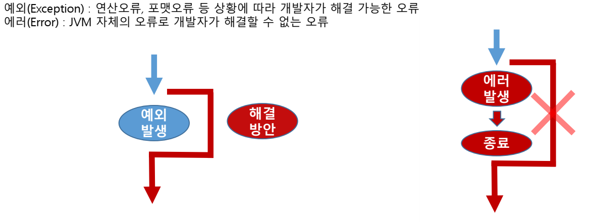
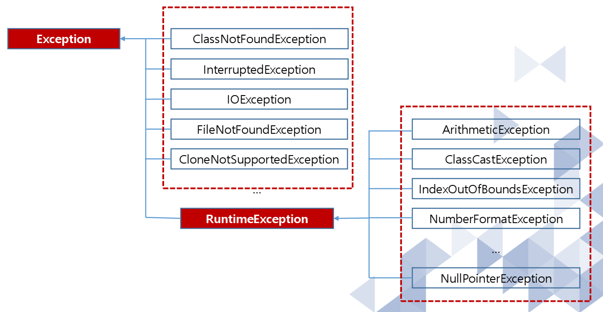
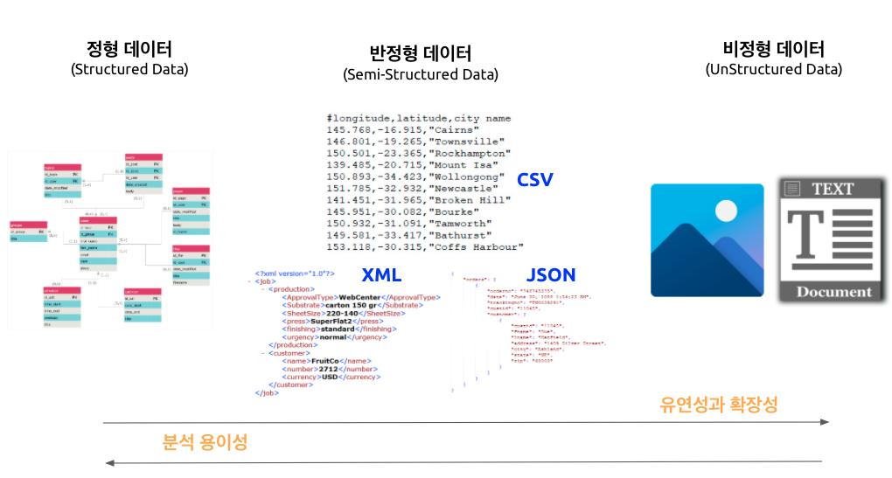
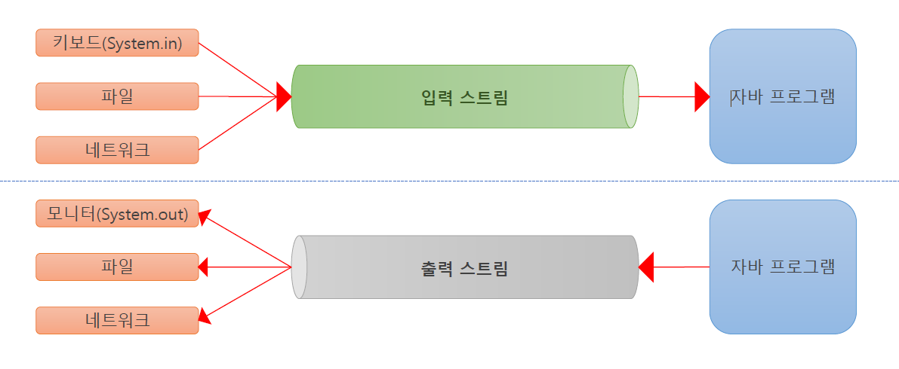
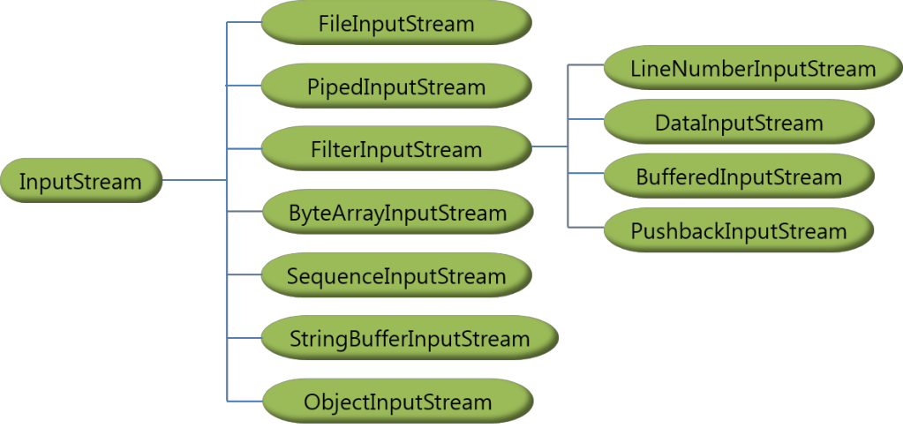
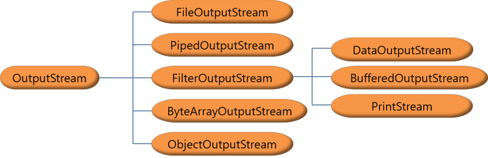
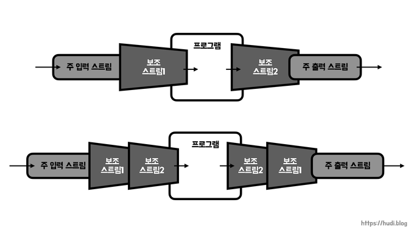
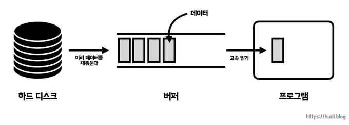
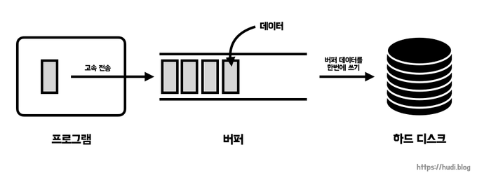

# Day 01

## 💡 주제
```
📌 예외 처리 (Exception Handling)
   ➡️ 자바에서 발생 가능한 예외를 처리하는 방법 이해하기 (`try-catch`, `finally`, `throw`, `throws`)
📌 파일과 디렉토리 관리 (File and Directory Management)
   ➡️ `File` 클래스를 활용하여 파일과 디렉토리의 생성, 삭제, 정보 조회 및 경로 확인 방법 익히기
📌 입출력 스트림 (Input/Output Streams)
   ➡️ 바이트 스트림과 문자 스트림을 사용한 파일 입출력 처리 및 `Buffered` 클래스를 활용한 효율적인 데이터 처리 이해하기
```

## 📄 파일 설명
| 파일명                                 | 내용              |
|:------------------------------------|:----------------|
| Ex01_String01                       | ArrayList 사용 예제 |
| Ex02_Exception01 ~ Ex10_Exception09 | 다양한 예외 처리 방식을 다루며 if문을 활용한 예외 방지, try-catch-finally 블록을 사용한 예외 처리, 여러 catch 구문으로 특정 예외 처리, throw와 throws를 통한 예외 발생 및 전파 방법을 포함하는 예제 |
| Ex11_File01 ~ Ex14_File04           | File 클래스를 사용해 파일과 디렉토리 생성, 존재 여부 확인, 삭제, 경로 출력, 파일 정보 조회, 디렉토리 내 파일 목록 출력 등을 수행하는 파일 및 디렉토리 관리 예제 |
| Ex15_IO01 ~ Ex22_IO08               | FileInputStream, FileOutputStream을 통해 파일 입출력을 다루며, BufferedInputStream, BufferedOutputStream을 이용한 버퍼링 처리, FileReader, FileWriter, BufferedReader를 활용해 텍스트 파일을 문자 단위 및 줄 단위로 읽고 쓰는 예제 |

## ✏️ 정리

### Exception

**1) 예외란**
- 예외는 프로그램 실행 중 발생하는 비정상적인 상황을 의미함
- 예를 들면, 배열 인덱스 초과, 파일을 찾을 수 없음, null 값을 참조하려고 할 때 발생하는 오류 등이 예외임
- 예외가 발생하면 프로그램의 정상적인 흐름이 깨질 수 있으므로, 예외를 처리해야 프로그램이 정상적으로 종료되거나 안정적으로 실행됨




<br>

**cf) `if`문을 사용한 예외 방지**
- `if`문을 사용하여 예외 상황을 처리하는 방법은 프로그램이 예외를 발생시키지 않고, 조건을 확인하여 예외가 발생할 가능성이 있는 상황을 미리 처리하는 방식임
- 예를 들면, 숫자를 0으로 나누는 오류는 미리 조건을 확인하여 방지할 수 있음

<br>

**2) 예외의 종류**
- Checked Exception (검사된 예외)
  - **컴파일러가 예외 처리를 강제하는 예외**임
  - 예외가 발생할 가능성이 있는 코드는 반드시 `try-catch`로 처리하거나, `throws` 키워드를 사용하여 호출하는 메서드에 예외 처리를 위임해야 함
  - ex) `IOException`, `SQLException`, `FileNotFoundException`
- Unchecked Exception (검사되지 않은 예외)
  - 런타임에 발생하는 예외로, **컴파일러가 예외 처리를 강제하지 않음**
  - 주로 프로그래머의 실수로 발생하며, 논리적인 로유나 잘못된 입력이 원인이 됨
  - ex) `NullPointerException`, `ArrayIndexOutOfBoundsException`, `AritmeticException`

<br>

**3) 예외 처리 구문 (`try-catch-finally`)**
- `try` 블록
  - 예외가 발생할 가능성이 있는 코드를 작성함
- `catch` 블록
  - 예외가 발생하면 처리하는 코드를 작성함
- `finally` 블록
  - 예외 발생 여부와 상관 없이 항상 실행되는 블록임
  - 주로 자원 해제 (ex. 파일 닫기, 데이터베이스 연결 해제)에 사용됨

<br><br><br>

### thorw
**`thorw`란**
- 자바에서 예외를 명시적으로 발생시키는 데 사용하는 키워드
- 특정 조건에서 개발자가 직접 예외를 발생시키고, 그 예외를 처리할 수 있도록 하는 기능을 제공함
- 주로 사용자 정의 예외를 던지거나, 특정 로직에서 의도적으로 예외를 발생시킬 때 사용됨

```java
public class Example{
  public static void main(String[] args) {
    throw new NullPointerException("강제 예외 발생");
  }
}
```

<br>

**`thorw`를 사용하는 상황**
- 검증 조건에 맞지 않을 때
  - 입력값이 유효하지 않거나 특정 조건을 충족하지 못할 경우, 명시적으로 에외를 던져 오류를 처리하도록 할 수 있음
- 사용자 정의 예외
  - 사용자가 정의한 예외를 직접 발생시켜, 특정 상황에 맞는 오류 처리를 유도할 수 있음
- 프로그램 로직에서 특정 상태를 명확히 알릴 때
  - 프로그램에서 비정상적인 흐름이나 중단을 요구하는 경우 직접 예외를 던질 수 있음

<br><br><br>

### throws
**`throws`란**
- 자바에서 메서드 선언부에 사용되어 해당 메서드가 예외를 던질 가능성이 있음을 호출하는 쪽에 알리는 키워드
- 즉, 메서드 내부에서 발생할 수 있는 예외를 처리하지 않고, 호출한 곳으로 던질 때 사용함
- 이를 통해 호출한 메서드에서 예외를 직접 처리하거나, 또 다른 곳으로 예외 처리를 위임할 수 있음

**`throws`의 사용 목적**
- 메서드에서 발생할 수 있는 예외를 호출한 메서드로 전달하여 처리할 수 있도록 함
- Checked Exception (검사된 예외)에 대해 예외 처리를 강제함<br>
  -> `throws`를 사용하지 않으면 컴파일러에서 오류가 발생함
- Unchecked Exception (검사되지 않은 예외)는 `throws`로 명시할 필요가 없지만, 코드 가독성을 위해 사용하기도 함

**`throws`를 사용하는 이유**
- Checked Exception 처리 강제
  - 자바에서는 Checked Exception이 발생할 수 있는 메서드는 반드시 예외 처리를 강제함<br>
    -> 이를 처리하는 방식으로는 두 가지가 있음
      - `try-catch`로 직접 처리
      - `throws`로 호출한 곳으로 예외를 던져서 처리
- 예외 처리 위임
  - 메서드 내부에서 발생한 예외를 직접 처리하지 않고, 호출한 메서드가 그 예외를 처리하도록 할 수 있음<br>
    -> 이를 통해 예외 처리가 필요 없는 단순 로직과 예외 처리 로직을 분리할 수 있음

<br><br><br>

### `throw`와 `throws`의 차이
- `throw`
  - 실제로 예외를 발생시키는 데 사용됨
  - ex) `throw new Exception("강제 예외 발생);`
  - 예외를 명시적으로 발생시키는 키워드임
- `throws`
  - 메서드 선언부에서 예외가 발생할 가능성이 있음을 선언하는 키워드임
  - ex) `void method() throws IOException`
  - 해당 메서드가 특정 예외를 던질 수 있음을 명시하며, 호출하는 쪽에서 예외를 처리해야 함

<br><br><br>

### `java.io` 패키지

**`java.io` 패키지란**
- 입출력(IO)을 처리하는 데 필수적인 클래스들을 제공함
- 데이터의 입출력 처리와 관련된 다양한 스트림 클래스르 포함하고 있어서 프로그램이 파일, 네트워크, 메모리 등에서 데이터를 읽고 쓰는 작업을 간단하게 처리할 수 있게 도와줌

**데이터 종류**
- 임시 저장 데이터
  - 메모리에 저장되늰 휘발성 데이터로, 프로그램 종료 시 사라짐
- 영구 저장 데이터
  - 하드디스크나 SSD와 같은 영구적인 저장장치에 저장됨
  - 파일이나 데이터베이스를 사용해 저장함



<br>

**CRUD 작업**
- Create : 데이터 생성
- Read : 데이터 읽기
- Update : 데이터 갱신
- Delete : 데이터 삭제

-> 이러한 작업들은 자바에서 **파일 입출력** 시 자주 사용되며, `java.io` 패키지를 통해 쉽게 처리할 수 있음


<br><br><br>

### 절대 경로와 상대 경로
> 파일을 읽거나 쓸 때, 파일의 위치를 **경로**로 지정함<br>
> 자바에서는 파일의 경로를 지정할 때, **절대 경로**와 **상대 경로** 두 가지 방식이 있음<br>
> 이 둘은 파일 시스템 내에서 파일이나 디렉토리의 위치를 나타내는 방식이 다름

<br>

**절대 경로 (Absolute Path)**
- 절대 경로는 파일이나 디렉토리의 위치를 루트 디렉토리로 부터 완전한 경로로 나타냄
- 즉, 파일 시스템의 최상위 디렉토리에서 부터 시작하여 파일이나 디렉토리까지의 모든 경로를 명확하게 기술한 경로임
- 특징
  - 항상 동일한 경로를 가리킴
  - 어느 위치에서 실행하더라도 해당 경로는 변경되지 않음
- 예시
  - `C:\Users\Username\Documents\file.txt`<br>
    -> 이 예시에서, 경로는 루트 디렉토리인 `C:` 또는 `/`부터 시작해서 파일까지의 전체 경로를 지정함

<br>

**상대 경로 (Relative Path)**
- 상대 경로는 현재 작업 디렉토리 (현재 프로그램이 실행되고 있는 위치)를 기준으로 파일이나 디렉토리의 경로를 지정함
- 즉, 현재 디렉토리를 기준으로 상대적으로 어디에 파일이 있는지를 나타냄
- 특징
  - 현재 작업 디렉토리에 따라 경로가 달라질 수 있음
  - 프로그램이 실행되는 위치에 따라 파일의 경로가 다르게 해석됨
  - 프로젝트 내에서 동적으로 경로를 지정할 때 유용함
- 예시
  - 현재 디렉토리가 `C:\Users\Username\Documents`일 때
    - 상대 경로 : `file.txt` -> `C:\Users\Username\Documents\file.txt`
    - 상대 경로 : `..\file.txt1` -> `C:\Users\Username\file.txt`
    - cf) `..\`는 상위 디렉토리를 의미하며, 현재 디렉토리의 부모 디렉터리로 이동하는 데 사용됨

<br>

**상대 경로와 절대 경로의 차이점**

| 특징            | 절대경로                                                                                     | 상대경로                                                                   |
|-----------------|---------------------------------------------------------------------------------------------|---------------------------------------------------------------------------|
| **정의**        | 루트 디렉토리부터 파일이나 디렉토리까지의 전체 경로를 나타냄                                   | 현재 작업 디렉토리를 기준으로 한 상대적인 경로를 나타냄                      |
| **파일 위치**    | 파일 위치가 명확하게 정의됨                                                                  | 현재 작업 디렉토리에 따라 파일 위치가 달라질 수 있음                        |
| **운영체제 차이**| 운영체제에 따라 경로 구조가 다를 수 있음 (예: Windows는 `C:\`, Unix 계열은 `/`)               | 프로그램 실행 위치에 따라 경로가 동적으로 변할 수 있음                      |
| **고정 여부**    | 언제나 고정된 경로를 참조                                                                    | 프로젝트나 파일의 구조가 바뀔 때 유용함                                     |


<br>

**실전에서의 사용**
- 절대 경로는 주로 파일의 위치가 명확하고 고정적일 때 사용함<br>
  -> 예를 들면, 시스템 파일이나 설정 파일의 경로를 다룰 때 유용함
- 상대 경로는 프로젝트 내에서 파일이나 자원을 동적으로 참조해야 할 때 사용함<br>
  특히, 파일의 위치가 자주 변경되거나, 다른 환경에서 동일한 코드를 실행할 때 유용함<br>
  -> 이를 통해 코드가 더 이식성 있게 동작할 수 있음

<br><br><br>

### File 클래스
> `File` 클래스는 자바에서 파일이나 디렉토리를 조작하기 위해 사용하는 클래스임<br>
> 파일의 생성, 삭제, 정보 조회와 같은 파일 시스템 관련 작업을 처리할 때 많이 사용됨<br>
> 그러나, 파일의 내용을 직접 읽거나 쓰는 작업은 하지 않고, 주로 파일이나 디렉토리 자체를 관리하는 데 사용됨

<br>

**`File` 클래스의 기본 개념**
- 파일과 디렉토리를 추상화한 클래스임
- 파일의 존재 여부 확인, 파일 삭제, 파일 경로 정보를 얻는 등의 파일 조작을 할 수 있음

<br>

**`File` 객체 생성**
- `File` 클래스는 파일이나 디렉토리의 경로를 기반으로 객체를 생성함

**`File` 클래스의 주요 메서드**

| 메서드                | 설명                                                    | 예시                                                |
|-----------------------|-------------------------------------------------------|-----------------------------------------------------|
| `exists()`            | 파일 또는 디렉토리가 존재하는지 확인합니다.                  | `file.exists()`  → `true`/`false`                    |
| `isFile()`            | 경로가 파일인지 확인합니다.                               | `file.isFile()`  → `true`/`false`                    |
| `isDirectory()`       | 경로가 디렉토리(폴더)인지 확인합니다.                      | `file.isDirectory()` → `true`/`false`               |
| `getName()`           | 파일 또는 디렉토리의 이름을 반환합니다.                      | `file.getName()`  → `"example.txt"`                 |
| `getAbsolutePath()`   | 파일 또는 디렉토리의 절대 경로를 반환합니다.                 | `file.getAbsolutePath()` → `"C:/path/to/example.txt"` |
| `length()`            | 파일의 크기(바이트 단위)를 반환합니다.                      | `file.length()`  → `1024` (바이트)                  |
| `createNewFile()`     | 새로운 파일을 생성합니다. 이미 파일이 존재하면 생성되지 않습니다. | `file.createNewFile()` → `true`/`false`             |
| `delete()`            | 파일 또는 디렉토리를 삭제합니다.                          | `file.delete()`  → `true`/`false`                   |
| `mkdir()`             | 하나의 디렉토리를 생성합니다.                            | `file.mkdir()` →  `true`/`false`                    |
| `mkdirs()`            | 상위 디렉토리까지 포함하여 디렉토리를 생성합니다.             | `file.mkdirs()`  → `true`/`false`                   |
| `list()`              | 디렉토리 내의 파일 및 디렉토리 이름 목록을 배열로 반환합니다.   | `dir.list()` → `{"file1.txt", "file2.txt", "folder"}` |
| `listFiles()`         | 디렉토리 내의 파일 및 디렉토리 목록을 `File` 객체 배열로 반환합니다. | `dir.listFiles()`  → `[File("file1.txt"), File("folder")]` |
| `canRead()`           | 파일이 읽기 가능한지 확인합니다.                         | `file.canRead()`  → `true`/`false`                  |
| `canWrite()`          | 파일이 쓰기 가능한지 확인합니다.                         | `file.canWrite()`  → `true`/`false`                 |

<br><br><br>

### Input / Ouput 스트림

**스트림(Stream)이란**
- 스트림이란 데이터의 흐름을 의미하며, 데이터를 읽고 쓰는 과정을 추상화한 개념임
- 자바의 입출력 시스템은 스트림을 통해 데이터를 주고 받음
- 입력 스트림 (Input Stream)은 외부로부터 데이터를 읽어오는 스트림임
- 출력 스트림 (Ouput Stream)은 데이터를 외부로 출력하는 스트림임



<br>

**스트림의 종류**
- 바이트 스트림 (Byte Stream)
  - 바이트 단위 (8bit)로 데이터를 처리하는 스트림
  - 모든 유형의 데이터를 처리할 수 있으며, 파일, 이미지, 오디오 등의 바이너리 데이터에 적합함
  - 바이트 스트림 클래스로는 `InputStream`과 `OuputStream`이 있음
- 문자 스트림 (Character Stream)
  - 문자 단위 (16bit)로 데이터를 처리하는 스트림
  - 텍스트 데이터를 읽거나 쓸 때 사용되며, 유니코드 문자를 처리하기 위해 설계됨
  - 문자 스트림 클래스로는 `Reader`와 `Writer`가 있음





| 스트림 종류 | 입력 클래스 | 출력 클래스 | 데이터 유형 |
|-- |-- |-- |-- |
| 바이트 스트림 | `FileInputStream` | `FileOutputStream` | 바이트 데이터 (텍스트, 이미지, 비디오 등) |
| 문자 스트림 | `FileReader` | `FileWriter` | 문자 데이터 (텍스트 파일) |

<br><br><br>

### 주 스트림과 보조 스트림

**주 스트림 (Primary Stream)**
- 주 스트림은 **데이터 입출력 작업을 처리**하는 스트림임
- 파일, 네트워크, 메모리 등에서 직접 데이터를 읽고 쓰는 스트림으로, 바이트 스트림과 문자 스트림을 포함함
- 주 스트림은 입출력의 기본 역할을 하며, 데이터를 읽거나 쓰는 핵심 작업을 수행함

**보조 스트림 (Secondary Stream)**
- 보조 스트림은 **주 스트림을 감싸거나 연결하여 추가 기능을 제공**하는 스트림임
- 보조 스트림 자체는 데이터를 직접 입출력하지 않고, 주 스트림에 성능 향상이나 데이터 변환 등의 부가적인 기능을 제공함
- 예를 들면, **버퍼링, 데이터 변환 (객체 직렬화), 필터링** 등의 기능을 제공함
- 보조 스트림의 주요 역할
  - 버퍼링
    - 입출려 성능을 개선하는 역할
    - `BufferedInputStream`, `BufferedReader` : 데이터를 버퍼링하여 성능을 향상시킴
  - 데이터 변환
    - 기본 타입이나 객체를 스트림으로 변환하거나, 반대로 스트림에서 데이터를 변환해 처리함
    - `DataInputStream`, `DataOutputStream` : 기본 데이터 타입을 스트림에 쓰거나 읽을 수 있게 해줌
    - `ObjectInputStream`, `ObjectOutputStream` : 객체를 직렬화해서 스트림으로 쓰거나, 역직렬화 해서 객체로 복원할 수 있게 해줌



<br>

**버퍼링을 통한 성능 개선**
- 파일 입출력 작업에서 버퍼링 (Buffering)을 사용하면 성능을 크게 향상시킬 수 있음
- 버퍼를 사용하면 데이터가 일정 크기만큼 모일 때 한 번에 처리되므로, 입출력 속도가 빨라짐
- 버퍼링 클래스
  - 바이트 스트림 : `BufferedInputStream`, `BufferedOutputStream`
  - 문자 스트림 : `BufferedReader`, `BufferedWriter`




**버퍼를 사용하는 이유**
- 컴퓨터의 입출력 장치 (디스크, 네트워크, 키보드 등)와 프로그램 간에느 속도 차이가 큼<br>
  -> 프로그램은 처리 속도가 빠른 반면, 입출력 장치의 속도는 상대적으로 느리기 때문에 작은 데이터를 여러 번 주고 받을 경우 성능 저하가 발생할 수 있음
- 이때, 버퍼를 사용하면 데이터를 한 번에 모아서 처리하여 입출력 작업의 빈도를 줄이고, 전체적인 성능을 개선할 수 있음
- 버퍼를 사용하지 않는 입출력은 우편 배달부가 편지를 하나씩 배달하는 것과 같음
- 버퍼를 사용하는 입출력은 편지를 일정량 모아서 한 번에 배달하는 것과 같음


<br><br><br>

## 📑 참고
Java SE 17 & JDK 17 Exception 관련: https://docs.oracle.com/en/java/javase/17/docs/api/java.base/java/lang/Exception.html
Java SE 17 & JDK 17 Exception 관련: https://docs.oracle.com/javase/specs/jls/se17/html/jls-11.html#jls-11.2