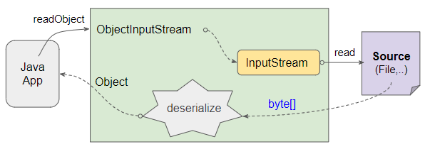

# Day 09

## 💡 주제
```
📌 자바 기초 구조
   ➡️ 자바 프로그램의 기본 구조와 시작 방법 이해하기
📌 입출력
   ➡️ 콘솔에 출력하는 기본적인 방법 이해하기
📌 변수와 자료형
   ➡️ 다양한 변수 선언과 자료형의 사용법 이해하기
📌 형 변환
   ➡️ 자료형 간의 자동 및 강제 형 변환 이해하기
📌 연산자
   ➡️ 산술, 비교, 논리, 대입, 증감 연산자의 기본 동작 이해하기
```

## 📄 파일 설명
| 파일명 | 내용 |
|:--   |:--      |
| Ex01_Start | 자바 프로그램 시작 구조 |
| Ex02_Print | 출력 함수 예제 |
| Ex03_Variable01 ~ Ex04_Variable02 | 변수 선언 및 사용 예제 |
| Ex05_DataType01 ~ Ex10_DataType06 | 기본 자료형과 진법 예제 |
| Ex11_Casting01 ~ Ex12_Casting02 | 자료형 변환 예제 |
| Ex13_Operator01 ~ Ex19_Operator07 | 산술, 비교, 논리, 대입, 증감 연산자 예제 |

## ✏️ 정리

### 보조 스트림

**보조 스트림이란**
- 보조 스트림 (Secondary Stream)은 주 스트림을 감싸서 추가적인 기능을 제공하는 스트림임
- 예를 들면, `ObjectOutputStream`은 바이트 스트림 위에 적용되어 객체를 직렬화하고, 이를 바이트 스트림으로 처리하는 기능을 제공함

```
📌 주 스트림 : 파일, 네트워크 등에서 데이터를 실제로 읽고 쓰는 역할 담당
📌 보조 스트림 : 주 스트림에 부가적인 기능을 추가함 (ex. 객체 직렬화, 버퍼링 등)
```

<br>

**`DataOutputStream`**
- 기본 데이터 타입을 바이너리 형식으로 출력(쓰기)할 수 있는 스트림
- 기본 타입의 값을 직접 파일이나 스트림에 기록할수 잇으며, 이를 통해 데이터가 텍스트 형식이 아닌, 바이너리로 저장됨
- 주요 메서드
  - `writeInt(int)` : 정수를 바이너리 형식으로 씀
  - `wirteDouble(double)` : 실수를 바이너리 형식으로 씀
  - `writeBoolean(boolean)` : 논리 값을 바이너리 형식으로 씀
  - `writeUTF(string)` : UTF-8 인코딩으로 문자열을 씀

<br>

**`DataInputStream`**
- 바이너리 형식으로 저장된 데이터를 읽어, 이를 기본 데이터 타입으로 변환해줌
- 바이너리 파일이나 네트워크로 전송된 이진 데이터에서 직접 정수, 실수 등의 기본형 데이터를 읽어올 수 있음
- 주요 메서드
  - `readInt()` : 바이너리로 저장된 정수를 읽어옴
  - `readDouble()` : 바이너리로 저장된 실수를 읽어옴
  - `readBoolean()` : 바이너리로 저장된 논리 값을 읽어옴
  - `readUTF()` : UTF-8 형식으로 저장된 문자열을 읽어옴

<br>

**`DataInputStream`과 `DataOutputStream`의 사용 목적**
- 기본 데이터 타입을 효율적으로 처리
  - 정수, 실수, 논리 값과 같은 기본 데이터 타입을 바이너리 형식으로 읽고 쓰기 위한 클래스임
  - 텍스트 형식이 아닌 바이너리 형식으로 데이터를 처리하므로, 네트워크 프로그래밍이나 파일 크기를 줄여야 할 때 유용함
- 바이너리 데이터의 입출력
  - 이 클래스들은 바이너리 데이터를 처리하기에 네트워크 프로그래밍이나 파일 포캣을 다룰 때 자주 사용됨
  - 기본 데이터 타입을 이진 형식으로 저장할 수 있으므로, 파일 크기를 줄이고 빠르게 읽고 쓸 수 있음

<br>

**주의사항**
- 읽고 쓰는 순서 일치
  - 데이터를 읽을 때는 기록한 순서대로 읽어야 함
  - 예를 들면, 먼저 `writeInt()`로 기록한 후, 나중에 `readInt()`로 읽어야 함
  - 순서가 일치하지 않으면 데이터가 잘못 해석될 수 있음
- 텍스트 파일과 호환되지 않음
  - `DataInputStream`과 `DataOutputStream`은 바이너리 데이터를 처리하므로, 텍스트 파일로 열면 바로 읽을 수 없음
  - 이진 데이터를 사람이 읽을 수 있는 형식으로 변환하려면 별도의 처리 과정이 필요함

<br><br>

**Object(I/O)Stream**
> `ObjectInputStream`과 `ObjectOutputStream`은 자바에서 객체를 직렬화하거나 역직렬화하여 파일, 네트워크 스트림 등으로 입출력할 수 있게 도와주는 보조 스트림임<br>
> 이 스트림들은 객체를 저장하고 복원하는 기능을 제공하므로, 데이터를 단순한 바이트나 텍스트 뿐만 아니라 객체 형태로도 저장할 수 있음



<br>

**`ObjectOutputStream`**
- 객체를 직렬화하여 파일 또는 다른 출력 스트림에 기록하는 데 사용됨
- 직렬화된 객체는 바이트 형태로 저장되며, 파일이나 네트워크로 전송할 수 있음<br>
cf) 직렬화 (Serialization)
  - 객체를 바이트 형식으로 변환하여 파일에 저장하거나 네트워크를 통해 전송할 수 있도록 만드는 과정임
  - 객체의 상태 (필드 값)를 바이트 스트림으로 변환하여 저장할 수 있게 해줌

<br>

**`ObjectInputStream`**
- 직렬화된 객체 데이터를 읽어 객체로 복원하는 데 사용됨
- 이는 파일이나 네트워크로부터 바이트 스트림을 받아, 다시 객체 형타로 변환하는 기능을 제공함<br>
cf) 역직렬화 (Deserialization)
  - 바이트 스트림으로 부터 객체를 복원하는 과정임
  - 즉, 파일이나 네트워크로 전송된 바이트 데이터를 객체로 복구하는 것임

<br><br><br>

### IOStream 활용 : Properties로 구성정보 관리하기
- `Map` 인터페이스의 구현체 중 하나인 `properties`는 **키-값 쌍**을 저장하는 특수한 형태의 맵으로, 주로 프로그램 설정이나 구성 정보를 관리하는 데 사용됨
- 자바의 `properties` 클래스는 파일로부터 설정을 읽거나 파일로 설정을 저장하는 기능을 제공함

<br><br><br>

### Java에서 엑셀 다루기 : JXL 라이브러리

**JXL (Java Excel API) 라이브러리**
- JXL은 자바에서 Microsoft Excel 파일을 읽고 쓸 수 있는 라이브러리임
- JXL은 `.xls` 파일을 지원하며, 엑셀 파일에서 데이터를 읽어오거나 새로운 엑셀 파일을 생성하고 수정하는 기능을 제공함
- 특징
  - Excel 파일 읽기 / 쓰기 지원
  - Excel 2003 이전 버전을 주로 지원함
  - 다양한 데이터 타입을 처리할 수 있음
  - 서식 지정 기능을 일부 지원함 (셀 스타일, 글꼴, 크기 등)

<br><br><br>

## 📑 참고
- 온라인 자바 튜토리얼: https://www.w3schools.com/java/
