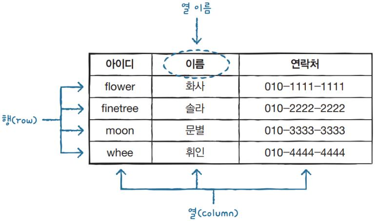
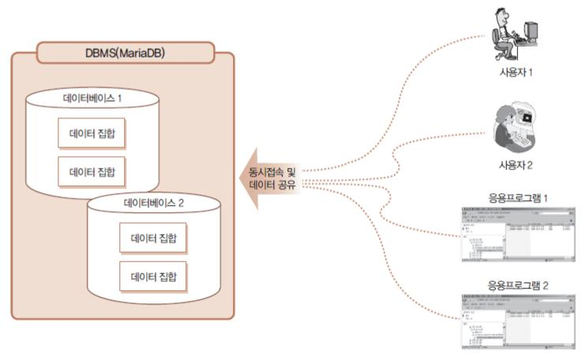
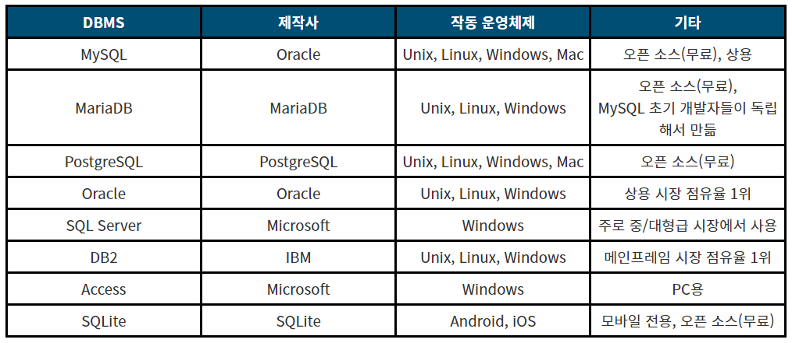
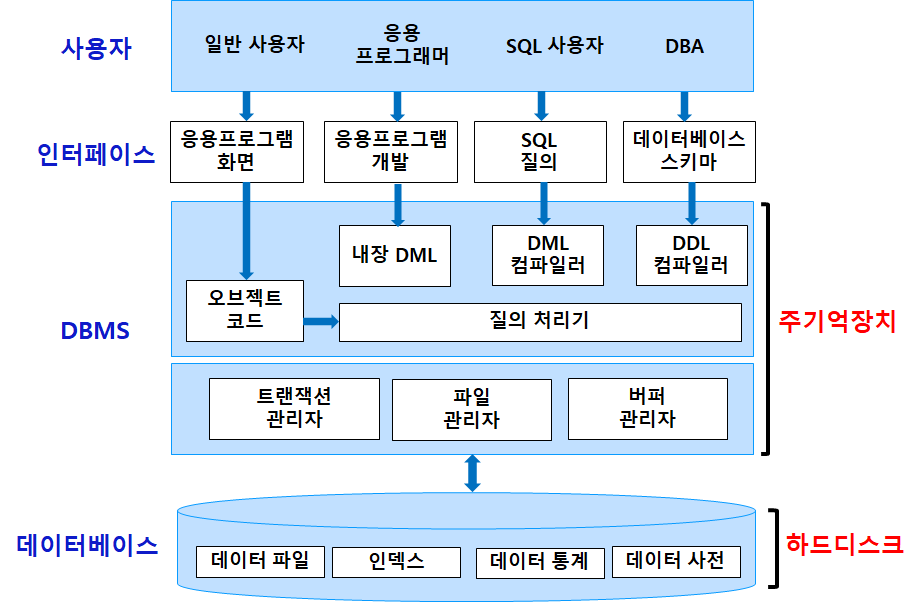
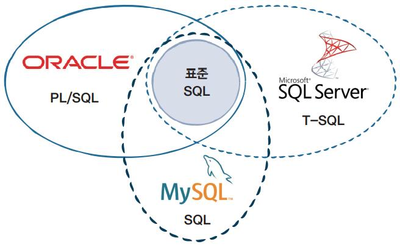

# Day 10

## 💡 주제
```
📌 기본 입출력과 파일 처리
   ➡️ 다양한 입출력 스트림을 활용하여 파일을 읽고 쓰는 방법 이해하기
📌 객체 직렬화와 역직렬화
   ➡️ 객체를 파일로 저장하고 복원하는 과정과 관련된 스트림 이해하기
📌 Properties를 통한 설정 관리
   ➡️ 프로그램 구성 정보를 파일로 저장하고 로드하는 방법 이해하기
📌 Excel 파일 처리
   ➡️ 외부 라이브러리를 사용하여 엑셀 파일을 읽고 필요한 데이터를 추출하는 방법 이해하기
```

## 📄 파일 설명
| 파일명                               | 내용                                              |
|:----------------------------------|:------------------------------------------------|
| Ex01_IO01 ~ Ex11_IO11             | 다양한 입출력 스트림을 사용한 파일 읽기 및 쓰기 예제                  |
| Ex12_PropertiesFileWriter         | `Properties` 클래스를 사용하여 설정 정보를 파일에 저장하는 예제       |
| Ex13_PropertiesFileReader         | Properties 파일을 읽어와서 프로그램 내에서 설정 값을 로드하고 활용하는 예제 |
| Ex14_Excel01                      | JXL 라이브러리를 사용하여 Excel 파일을 읽어오는 예제               |

## ✏️ 정리

### 데이터베이스

**데이터베이스 기본 개념**
- **데이터베이스(Database)**
  - 데이터를 체계적으로 저장하고 관리하는 시스템
  - 여러 사람이 데이터를 쉽게 접근하고 관리할 수 있도록 도와줌
  - 마치 책장이 여러 책을 분류해 정리해 놓은 것처럼, 데이터를 잘 관리할 수 있는 구조라고 보면 됨
- **DBMS (Database Management System)**
  - 데이터베이스를 관리하는 소프트웨어임
  - MySQL, PostgreSQL, Oracle, SQLite 등이 대표적인 DBMS임
- **테이블 (Table)**
  - 데이터베이스에서 데이터를 저장하는 기본 단위임
  - 테이블은 엑셀의 시트와 비슷한 구조로, 가로는 행 (row), 세로는 열 (column)로 구성됨
- **레코드 (Record)**
  - 테이블의 각 행을 의미함
  - 하나의 데이터 묶음이라고 보면 됨
- **필드 (Field)**
  - 테이블의 각 열을 의미함
  - 데이터를 설명하는 속성임
  - 예를 들면, 이름, 나이, 직업 등이 필드가 될 수 있음



<br><br><br>

### DBMS



**데이터베이스의 특징**
- 데이터 무결성
  - 데이터베이스에 저장된 데이터는 정확하고 신뢰할 수 있어야 함
  - 무결성은 데이터의 정확성, 일관성을 유지하기 위한 규칙으로, 중복되거나 잘못된 데이터 입력을 방지함
- 데이터 일관성
  - 데이터베이스 내에서 동일한 데이터는 항상 일관되게 유지되어야 함
  - 즉, 하나의 데이터가 수정되면, 관련된 모든 데이터에 동일한 수정이 적용되어야 함
- 데이터 독립성
  - 데이터베이스 시스템에서는 데이터의 논리적 구조와 물리적 구조를 분리하여, 데이터 저장 방식이 변경되더라도 응용 프로그램은 영향을 받지 않는 특징을 가지고 있음
- 데이터 중복 최소화
  - 데이터베이스에서는 동일한 데이터를 여러 번 저장하는 것이 아닌, 한 번만 저장하고 필요한 경우 관계를 통해 참조하는 방식으로 데이터를 관리함
  - 이를 통해 저장 공간을 절약하고, 데이터의 중복과 불필요한 업데이트를 방지할 수 있음
- 동시성 제어
  - 데이터베이스는 여러 사용자가 동시에 접근하더라도, 데이터가 손상되지 않고 안전하게 관리될 수 있도록 동시성 제어 기능을 제공함
  - 예를 들면, 두 사용자가 같은 데이터를 수정하려고 할 때 충돌을 방지하는 역할을 함

<br>

**DBMS의 종류**


<br>

**DBMS의 사용자**
- 일반 사용자
  - 응용 프로그램을 통해 DBMS에 접근함
  - 이들은 주로 데이터 조회, 입력, 수정, 삭제 작업을 함
  - SQL을 직접 다루지 않고, 응용 프로그램 화면을 통해 간접적으로 DBMS와 상호작용함
- 응용 프로그래머
  - 데이터베이스와 연동된 응용 프로그램을 개발하는 사람들임
  - 이들은 프로그램에서 SQL을 사용하여 데이터베이스와 직접 통신하며, 이를 통해 데이터를 조회하거나 저장하는 기능을 구현함
- SQL 사용자
  - SQL을 사용하여 DBMS에 직접 쿼리를 날리는 사용자들임
  - 데이터를 조작하거나 조회할 때, SQL 질의를 작성하여 DBMS와 상호작용함
- DBA (데이터베이스 관리자)
  - 데이터베이스를 설계하고 관리하는 사람임
  - 이들은 데이터베이스 스키마를 정의하고, 성능 최적화, 보안 관리, 백업과 복구 등을 책임짐



<br>

**개발자가 하는 일**
- 개발자는 데이터베이스와 상호작용하는 애플리케이션을 개발하는 역할을 함
- 이들은 프로그램에서 SQL을 사용하여 데이터를 삽입, 조회, 수정, 삭제하며, 데이터베이스와 연동되는 코드를 작성함
- 개발자는 데이터베이스 구조를 이해하고, 필요한 경우 DBA와 협력해 데이터베이스에 적합한 코드를 작성함
- 주요 역할
  - SQL 쿼리 작성
    - 애플리케이션에서 필요한 데이터를 효율적으로 조회하고 조작하기 위해 SQL 쿼리를 작성함
    - 특히, 성능을 고려한 쿼리 작성이 중요함
  - 데이터베이스 연동 코드 작성
    - 애플리케이션이 데이터베이스와 통신할 수 있도록 JDBC, ODBC 등의 API를 사용하여 데이터베이스 연동 코드를 작성함
  - 트랜잭션 처리
    - 애플리케이션에서 데이터의 일관성을 유지하기 우해 트랜잭션을 적절히 관리함
    - 여러 데이터베이스 작업이 하나의 트랜잭션으로 처리되도록 코드를 작성함
  - DBA와 협업
    - 데이터베이스 성능에 영향을 미치는 쿼리 작성 시, DBA와 협력하여 최적의 데이터베이스 구조를 설계함
    - 개발자는 테이블 및 인덱스 설계, 쿼리 최적화 등의 작업에서 DBA와 협업함

<br><br><br>

### SQL (Structured Query Language)



**표준 SQL (Standard SQL)**
- 가운데에 있는 표준 SQL은 미국 ANSI (미국 표준 협회)와 ISO (국제 표준화 기구)에서 정한 관계형 데이터베이스 언어의 표준임
- SQL은 데이터를 조회, 삽입, 수정, 삭제하기 위한 기본적인 명령어들을 포함하고 있으며, 대부분의 DBMS는 이 표준 SQL을 기반으로 사용함

<br>
 
- 표준 SQL이 모든 DBMS의 기본이 되는 언어이지만, 각각의 데이터베이스 시스템 (Oracle, MySQL, SQL Server)은 각자 고유한 확장 기능을 가지고 있어, 표준 SQL 외에도 자신만의 기능들을 제공함
  - Oracle은 PL / SQL 을 통해 절차적인 기능을 추가함
  - MySQL은 표준 SQL을 거의 그대로 따름
  - Microsoft SQL Server는 T-SQL이라는 확장된 SQL을 사용하여 더 다양한 기능을 지원함

<br>

> ERP (Enterprise Resource Planning, 전사적 자원 관리)<br>
> - 기업의 핵심 비즈니스 프로세스를 통합하과 관리하는 소프트웨어임
> - ERP 시스템은 재무, 인사, 생산, 물류, 영업, 구매 등 다양한 비즈니스 기능을 통합하여, 조직 내 자원의 흐름을 실시간으로 관리하고 효율성을 극대화하는 역할을 함

<br><br><br>

## 📑 참고
- 온라인 자바 튜토리얼: https://www.w3schools.com/java/
